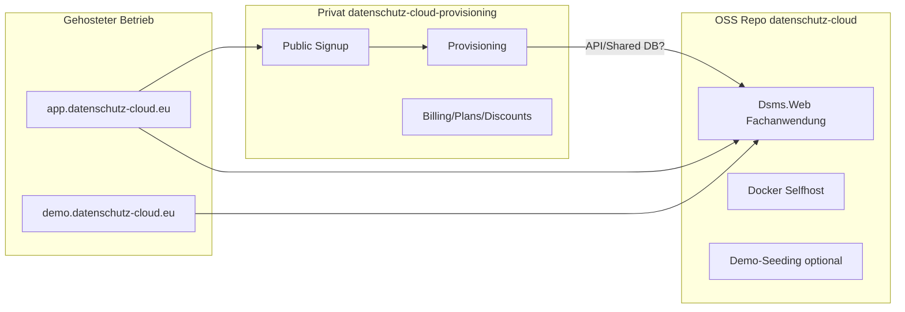

# Open-Source-Readiness – Datenschutz-Cloud / DSMS

> **Stand der Analyse:** 2026-06-15  
> **Zweck:** Dokumentation aller Maßnahmen, damit die **Fachanwendung** als eigenständiges Open-Source-Projekt veröffentlicht werden kann – **ohne** SaaS-Provisioning, öffentliche Registrierung, Rabattcodes, Billinglogik, produktive Rechtstexte, Secrets oder kommerzielle Betriebslogik.  
> **Hinweis:** Dieses Dokument ist eine technische Analyse. Es ersetzt keine Rechtsberatung und trifft keine finale Lizenzentscheidung.

---

## Inhaltsverzeichnis

1. [Öffentliche Registrierung / Signup](#1-öffentliche-registrierung--signup)
2. [Provisioning](#2-provisioning)
3. [PendingSignups / Registrierungsverwaltung](#3-pendingsignups--registrierungsverwaltung)
4. [Tarif-/Planverwaltung](#4-tarif-planverwaltung)
5. [Rabattcodes](#5-rabattcodes)
6. [Lizenzverwaltung](#6-lizenzverwaltung)
7. [E-Mail-Funktion](#7-e-mail-funktion)
8. [Legal-Dokumente und Rechtstexte](#8-legal-dokumente-und-rechtstexte)
9. [Secrets, Konfiguration und produktive Daten](#9-secrets-konfiguration-und-produktive-daten)
10. [Branding und Markenrechte](#10-branding-und-markenrechte)
11. [Demo-Seeding und Beispielbenutzer](#11-demo-seeding-und-beispielbenutzer)
12. [Docker und Selfhosting](#12-docker-und-selfhosting)
13. [Routen- und Navigationsprüfung](#13-routen--und-navigationsprüfung)
14. [Services-/Klassen-Matrix](#14-services-klassen-matrix)
15. [Entity-/Migrationen-Matrix](#15-entity-migrationen-matrix)
16. [README-/Dokumentations-Readiness](#16-readme-dokumentations-readiness)
17. [Lizenzstrategie](#17-lizenzstrategie)
18. [Zielbild nach Bereinigung](#18-zielbild-nach-bereinigung)
19. [Konkrete empfohlene Arbeitspakete](#19-konkrete-empfohlene-arbeitspakete)
20. [Offene Fragen, Risiken, nächste Schritte](#20-offene-fragen-risiken-nächste-schritte)

---

## 1. Öffentliche Registrierung / Signup

### 1.1 Inventar

| Kategorie | Pfad / Symbol |
|-----------|---------------|
| **Route `/signup`** | `Dsms.Web/Components/Pages/Signup/Index.razor` |
| **Route `/signup/success`** | `Dsms.Web/Components/Pages/Signup/Success.razor` |
| **Route `/signup/paid`** (Redirect → `/signup?preferPaid=true`) | `Dsms.Web/Components/Pages/Signup/Paid/Index.razor` |
| **Route `/signup/paid/success`** (Legacy) | `Dsms.Web/Components/Pages/Signup/Paid/Success.razor` |
| **Layout** | `Dsms.Web/Components/Layout/PublicSignupLayout.razor` |
| **Footer Legal-Links** | `Dsms.Web/Components/Shared/LegalFooter.razor` |
| **Service (aktiv)** | `IPublicSignupService` / `PublicSignupService` → `Dsms.Web/Services/Signup/` |
| **Service (Legacy, DI registriert, keine Razor-Nutzung)** | `IPaidSignupService` / `PaidSignupService` |
| **FreeSignupService** | **Entfernt** (nur historisch in `Changelog.md`) |
| **DTOs** | `Dsms.Web/Services/Signup/PublicSignupDtos.cs` (`PublicSignupPlanDto`, `PublicSignupFormDto`, `PublicSignupSubmitResult`) |
| **Legacy-DTOs** | `Dsms.Web/Services/Signup/PaidSignupDtos.cs` |
| **Pricing-Helfer** | `Dsms.Web/Services/Signup/PublicSignupPricingHelper.cs` |
| **Interne Benachrichtigung** | `ISignupNotificationService` / `SignupNotificationService` |
| **Legal-Mail nach Signup** | `ISignupLegalEmailService` / `SignupLegalEmailService` |
| **Rabatt-Helfer (Notification)** | `Dsms.Web/Services/Signup/SignupNotificationDiscountHelper.cs` |
| **Route-Klassifikation** | `Dsms.Web/Services/RouteAccessClassifier.cs` (`signup/*` = Plattform, kein Mandant) |
| **DI-Registrierung** | `Dsms.Web/Program.cs` |

### 1.2 Funktionsdetails

| Feature | Implementierung |
|---------|-----------------|
| **Honeypot** | Feld `Website` in `PublicSignupFormDto`; bei nicht-leerem Wert stiller Fehler (`PublicSignupService.SubmitSignupAsync`, Zeile ~121) |
| **Doppelabsende-Schutz** | UI-Flag `_submitting` in `Signup/Index.razor`; Submit-Button und Aktionen `disabled="@_submitting"`; Guard am Anfang der Submit-Handler |
| **Preisvorschau** | Tarifkarten mit monatlich/jährlich, Sonderpreis (durchgestrichen + Badge) in `Signup/Index.razor`; `PublicSignupPricingHelper` |
| **Billing monatlich/jährlich** | Feld `BillingCycle` in Formular; Validierung in `PublicSignupService.ValidateBillingCycle` |
| **Rabattcode** | Eingabe + „Code anwenden“ in UI; `ValidateDiscountCodeAsync` → `DiscountCodeValidationService.ValidateForSignupAsync` |
| **Legal-Checkboxen** | `AcceptAgb`, `AcceptPrivacyPolicy`, `AcceptDataProcessingAgreement`; Links zu `/legal/*` |
| **Erfolgsseite** | `/signup/success` – unterscheidet Free vs. Paid (Rechnungshinweis) |
| **Flow** | Plan wählen → PendingSignup anlegen → Provisioning → LegalAcceptance → Mails |

**Payment-Integration:** Mollie/Stripe **nicht implementiert**. Kostenpflichtige Pläne nutzen `PaymentProvider = "ManualInvoice"`. Entity-Felder (`ExternalPaymentId`, Status `PendingPayment`) sind Vorbereitung.

### 1.3 Bewertung

| Aspekt | Empfehlung |
|--------|------------|
| **Aus Open Source entfernen** | Gesamter öffentlicher Signup-Flow inkl. Routen, Services, DTOs, Layout, Legacy Paid-Signup |
| **In private Provisioning-App** | `PublicSignupService`, `SignupNotificationService`, `SignupLegalEmailService`, `PaidSignupService` (oder konsolidieren), alle Signup-Razor-Seiten |
| **Weiterleitung auf externe Signup-App** | **Sinnvoll.** Open-Source-Selfhoster brauchen keinen öffentlichen Signup; SaaS-Betreiber verlinken auf separate App |
| **Konfiguration (neu, noch nicht vorhanden)** | Empfohlen: `AppUrls:SignupAppBaseUrl` (z. B. `https://signup.datenschutz-cloud.eu`). Wenn leer: kein Signup-Link in Login/Footer/Nav; optional Redirect von `/signup` → externe URL oder 404/Info-Seite |
| **Zusätzliche Flags (neu)** | `Features:PublicSignupEnabled=false` (Default für OSS); `Features:RedirectSignupToExternal=true` |

### 1.4 Abhängigkeiten vor Entfernung

- `PublicSignupService` → `ISubscriptionPlanService`, `IProvisioningService`, `IPendingSignupService`, `IDiscountCodeValidationService`, `ILegalAcceptanceService`, `ILegalDocumentService`
- NavMenu/Login/Marketing-Verweise auf `/signup` müssen konfigurierbar werden
- Demo muss **ohne** öffentlichen Signup lauffähig bleiben (nur Demo-Login)

---

## 2. Provisioning

### 2.1 Inventar

| Kategorie | Pfad / Symbol |
|-----------|---------------|
| **Interface** | `Dsms.Web/Services/Provisioning/IProvisioningService.cs` |
| **Implementierung** | `Dsms.Web/Services/Provisioning/ProvisioningService.cs` |
| **DTOs** | `Dsms.Web/Services/Provisioning/ProvisioningDtos.cs` (`ProvisionCustomerRequestDto`, `ProvisionCustomerResultDto`) |
| **Route** | `/platform/provisioning/create` → `Dsms.Web/Components/Pages/Platform/Provisioning/Create.razor` |
| **Auth** | `[Authorize(Roles = DsmsRoles.Superuser)]` |

### 2.2 Ablauf (technisch)

`ProvisioningService.ProvisionCustomerAsync` in **einer DB-Transaktion**:

1. Validierung (Plan aktiv, Admin-E-Mail frei, Rollen vorhanden)
2. Optional: `PendingSignup` + Rabattcode-Validierung (`ValidateForProvisioningAsync`)
3. **License** erzeugen (`PlanToLicenseMapper`, `LicenseNumberGenerator`)
4. **Tenant** anlegen (`Tenant.LicenseId`)
5. **ApplicationUser** (Admin) + Rolle + `UserTenant`
6. Rabattcode-Einlösung (`CurrentRedemptions++`, `DiscountRedeemedAt`)
7. **LegalAcceptance** (`ILegalAcceptanceService.AddWithinTransactionAsync`)
8. `DocumentCategorySeeder.EnsureDefaultCategoriesAsync`
9. Commit → **Welcome-Mail** via `IPasswordResetService.SendProvisioningWelcomeEmailAsync` (Template `WelcomeSetPassword`)

### 2.3 System-/Auditlogs

| Action | Quelle |
|--------|--------|
| `CustomerProvisioned` | Audit |
| `ProvisioningFailed`, `AdminCreateFailed`, … | System |
| `DiscountCodeRedeemed`, `LicenseValidityAdjustedByDiscountCode` | Audit |
| `PublicSignupDiscountInvalidDuringProvisioning` | System |
| `PasswordSetupEmailFailed` | System |

### 2.4 Bewertung

| Aspekt | Empfehlung |
|--------|------------|
| **Aus Open Source entfernen** | `ProvisioningService`, `/platform/provisioning/create`, Aufruf aus `PublicSignupService` |
| **In private Provisioning-App** | Vollständiger kommerzieller Provisioning-Flow inkl. Plan→License, Rabatt, LegalAcceptance beim Signup |
| **Ev. in OSS behalten (Selfhosting)** | **Offene Entscheidung:** Minimaler lokaler Bootstrap (Superuser legt Mandant + Admin manuell an) existiert bereits über `/tenants`, `/users` – **ohne** `ProvisioningService`. Für OSS reicht das vermutlich |
| **PasswordResetService** | **Behalten** – auch für Einladungen; `SendProvisioningWelcomeEmailAsync` kann OSS-neutral umbenannt werden (`SendWelcomeSetPasswordEmailForNewUserAsync`) oder nur aus Provisioning-App aufgerufen werden |

---

## 3. PendingSignups / Registrierungsverwaltung

### 3.1 Inventar

| Kategorie | Pfad |
|-----------|------|
| **Entity** | `Dsms.Web/Domain/Entities/PendingSignup.cs` |
| **Status-Konstanten** | `Dsms.Web/Domain/PendingSignupStatuses.cs` |
| **Service** | `IPendingSignupService` / `PendingSignupService` → `Dsms.Web/Services/PendingSignups/` |
| **DTOs/Helper** | `PendingSignupDtos.cs`, `PendingSignupDisplayHelper.cs`, `BillingStatusDisplayHelper.cs`, `BillingCycleDisplayHelper.cs` |
| **Routen** | `/platform/signups`, `/platform/signups/create`, `/platform/signups/{Id:guid}` |

### 3.2 Relevante Felder (SaaS/Billing)

- **Billing:** `BillingStatus`, `BillingCycle`, `InvoiceSentAt`, `InvoicePaidAt`, `NextInvoiceDate`, `BillingNote`, `CurrentBillingAmount*`
- **Snapshots:** Plan-, Rabatt-, Kunden-, Mandanten-, Admin-Daten
- **Provisioning-Ergebnis:** `ProvisionedLicenseId`, `ProvisionedTenantId`, `ProvisionedAdminUserId`, …
- **Source:** `"PublicSignup"`, `"PaidSignup"`, manuelle Anlage
- **Payment-Vorbereitung:** `ExternalPaymentId`, `ExternalCheckoutUrl`, Status `PendingPayment`

### 3.3 Interne Signup-Benachrichtigung

`SignupNotificationService.TrySendPublicSignupNotificationAsync` → HTML-Mail an `EmailSettings.SystemNotificationRecipientEmail` (kein Template-Key, rohes HTML).

Log-Actions: `SignupNotificationSent`, `SignupNotificationSkipped`, `SignupNotificationFailed`.

### 3.4 Bewertung

| Frage | Antwort |
|-------|---------|
| **Vollständig SaaS-only?** | **Ja** – reine Registrierungs-/Billing-Vorstufe |
| **Vollständig aus Open Source entfernen?** | **Ja** (Code, UI, Seeding, Nav) |
| **In private Provisioning-App?** | **Ja** – Kernfunktion der Provisioning-App |
| **Abhängigkeiten zur Fachanwendung** | `LicenseService.Admin.cs` synchronisiert Billing-Infos aus PendingSignup; `UpgradeRequestService` nutzt `ISubscriptionPlanService`. Diese Kopplungen müssen vor Extraktion gelöst werden |

---

## 4. Tarif-/Planverwaltung

### 4.1 Inventar

| Kategorie | Pfad |
|-----------|------|
| **Entity** | `Dsms.Web/Domain/Entities/SubscriptionPlan.cs` |
| **Service** | `ISubscriptionPlanService` / `SubscriptionPlanService` |
| **DTOs/Helper** | `SubscriptionPlanDtos.cs`, `SubscriptionPlanDisplayHelper.cs` |
| **Seeder** | `Dsms.Web/Data/Seed/SubscriptionPlanSeeder.cs` |
| **Routen** | `/platform/plans`, `/platform/plans/{Id}`, `/platform/plans/edit`, `/platform/plans/edit/{Id}` |

### 4.2 SaaS-spezifische Felder

- Preise: `PriceMonthly`, `PriceYearly`, `Currency`
- Öffentlicher Signup: `IsPublicSignupEnabled`
- Marketing: `IsPromotionalPriceEnabled`, `PromotionalMonthlyPrice`, `PromotionalYearlyPrice`, `PromotionalBadgeText`
- Payment-Vorbereitung: `ExternalProductId`, `ExternalMonthlyPriceId`, `ExternalYearlyPriceId`
- Limits: identische Struktur wie `License` (MaxTenants, MaxUsersPerTenant, …)

### 4.3 Demo-Tarif-Seeding

`SubscriptionPlanSeeder` legt idempotent an: `free` (**IsPublicSignupEnabled=true**), `basic`, `pro`, `business` – mit EUR-Limits, teils ohne Preise.

### 4.4 Bewertung

| Aspekt | Empfehlung |
|--------|------------|
| **Reine SaaS-/Pricing-Logik** | Preise, Promotions, `IsPublicSignupEnabled`, External-*-IDs, Plattform-UI |
| **Fachanwendung braucht evtl. noch** | Limit-Werte – aber **aus `License`**, nicht aus `SubscriptionPlan` |
| **Langfristig ohne SubscriptionPlan?** | **Ja, möglich**, wenn `License` alle Limit-Snapshots enthält (bereits der Fall nach Provisioning). Pläne sind dann reine **Provisioning-Vorlagen** |
| **Aus Open Source entfernen** | Entity kann vorerst in DB bleiben (Migrationen), aber **Service + UI + Seeder-Pläne** entfernen oder durch neutrale Community-Lizenz ersetzen |
| **In private Provisioning-App** | Vollständige Planverwaltung |

---

## 5. Rabattcodes

### 5.1 Inventar

| Kategorie | Pfad |
|-----------|------|
| **Entity** | `Dsms.Web/Domain/Entities/DiscountCode.cs` |
| **Enums** | `Dsms.Web/Domain/Enums/DiscountCodeType.cs` (`Percentage`, `FixedAmount`, `FreeMonths`) |
| **Labels** | `Dsms.Web/Domain/DiscountCodeLabels.cs`, `Dsms.Web/Domain/BillingCycles.cs` |
| **Services** | `IDiscountCodeService` / `DiscountCodeService`, `IDiscountCodeValidationService` / `DiscountCodeValidationService` |
| **DTOs** | `DiscountCodeDtos.cs`, `DiscountCodeValidationResult.cs`, `DiscountCodeDisplayHelper.cs` |
| **Routen** | `/platform/discount-codes`, `/platform/discount-codes/{Id}`, `/platform/discount-codes/edit`, `/platform/discount-codes/edit/{Id}` |
| **Signup-Nutzung** | `PublicSignupService`, `Signup/Index.razor` |
| **Provisioning-Nutzung** | `ProvisioningService` (Einlösung nach Commit) |

### 5.2 Migrationen (betroffen)

- `20260611084837_AddDiscountCodes.cs`
- `20260611090431_AddPendingSignupDiscountFields.cs`
- `20260611093923_AddPendingSignupDiscountRedemptionFields.cs`

### 5.3 Logs

- `DiscountCodeRedeemed`, `LicenseValidityAdjustedByDiscountCode` (Audit)
- `PublicSignupDiscountInvalidDuringProvisioning`, `PublicSignupDiscountApplied` (System)
- CRUD-Auditlogs in `DiscountCodeService`

### 5.4 Bewertung

| Frage | Antwort |
|-------|---------|
| **Vollständig SaaS-only?** | **Ja** |
| **Vollständig aus Open Source entfernen?** | **Ja** (Code + UI; DB-Tabelle kann deprecated/leer bleiben oder spätere Migration entfernt Tabellen in separatem Schritt) |
| **In private Provisioning-App?** | **Ja** |

---

## 6. Lizenzverwaltung

### 6.1 Inventar

| Kategorie | Pfad |
|-----------|------|
| **Entity** | `Dsms.Web/Domain/Entities/License.cs` |
| **Service** | `ILicenseService` / `LicenseService` (Partial: `.cs`, `.Limits.cs`, `.Usability.cs`, `.Admin.cs`) |
| **Plan→License** | `IPlanToLicenseService`, `PlanToLicenseService`, `PlanToLicenseMapper`, `PlanToLicenseValidator`, `PlanToLicenseDtos.cs`, `LicenseNumberGenerator.cs` |
| **UI Plattform** | `/platform/licenses`, `/platform/licenses/{Id}`, `/platform/licenses/edit`, `/platform/licenses/create-from-plan` |
| **UI Admin (read-only)** | `/admin/license` → `Dsms.Web/Components/Pages/Admin/License.razor` |
| **Shared UI** | `LicenseLimitAlert.razor`, `LicenseUsageBadge.razor`, `LicenseLimitRow.razor` |
| **Guard** | `ILicenseCreateGuard` / `LicenseCreateGuard` |

### 6.2 Limit-Prüfungen (Fachanwendung – **behalten**)

`LicenseService.Limits.cs`: `CanCreateTenantAsync`, `CanCreateAdminAsync`, `CanCreateUserAsync`, `CanCreateAuditorAsync`, `CanCreateCustomAuditTemplateAsync`, `CanCreateActiveAuditAsync`, `CanCreateProcessingActivityAsync`, `CanCreateDpiaAsync`, `CanCreateTomAsync`, `CanCreateProcessorAsync`, `CanCreateActiveMeasureAsync`, `CanUseStorageAsync`, `CanSendEmailReminderAsync`.

Verwendet in zahlreichen Fachseiten (VVT, DSFA, TOMs, Audits, Users, Tenants, …).

### 6.3 Unterscheidung A / B / C

#### A) Muss in Open Source bleiben

- [x] `License`-Entity (Limits, Status, Gültigkeit)
- [x] `ILicenseService` Limit- und Usability-Prüfungen
- [x] `LicenseService.Admin.cs` – read-only Admin-Übersicht `/admin/license`
- [x] UI-Komponenten für Limit-Anzeige
- [x] `ILicenseCreateGuard` für Audit bei blockierten Aktionen

#### B) Sollte aus Open Source entfernt werden

- [ ] Kaufmännische Lizenz-CRUD unter `/platform/licenses/*`
- [ ] `/platform/licenses/create-from-plan`
- [ ] `IPlanToLicenseService`, `PlanToLicenseMapper`, `PlanToLicenseValidator`, `LicenseNumberGenerator` (Provisioning-Kontext)
- [ ] Billing-nahe Felder in Admin-UI, falls aus PendingSignup gespeist (`LicenseService.Admin.cs` – Billing-Sync prüfen)

#### C) Offene Entscheidung – Optionen

| Option | Beschreibung | Vorteile | Nachteile |
|--------|--------------|----------|-----------|
| **1. Lokale Lizenz-Konfiguration** | Superuser pflegt eine `License` manuell (SQL/Seed/Minimal-UI) | Limits testbar; nahe am SaaS-Modell | Mehr Setup-Aufwand für Selfhoster |
| **2. Ohne Lizenzlimits** | `License`-Checks deaktivierbar per Config | Einfachster Selfhost-Einstieg | Feature-Parität zu SaaS fehlt; Code-Pfade verzweigen |
| **3. Community-Lizenz per Seeding** | Beim Start eine „unlimited“ oder großzügige Demo-/Community-Lizenz | Guter Kompromiss für OSS + Demo | Grenze zwischen Demo und Produktion unscharf ohne klare Doku |

**Empfehlung (technisch, keine Produktentscheidung):** Option **3** für Demo/OSS-Quickstart + Option **1** für ernsthaften Selfhosting-Betrieb; Limits aus `License`, **ohne** `SubscriptionPlan`.

---

## 7. E-Mail-Funktion

### 7.1 Inventar

| Kategorie | Pfad |
|-----------|------|
| **Versand** | `IEmailService` / `EmailService` (MailKit) |
| **Einstellungen** | `IEmailSettingsService` / `EmailSettingsService`; Entity `EmailSettings` |
| **Templates** | `IEmailTemplateService`, `EmailTemplateService`, Entity `EmailTemplate` |
| **Rendering** | `IEmailTemplateRenderer` / `EmailTemplateRenderer` |
| **Secrets** | `IEmailSecretProtector` / `EmailSecretProtector` (ASP.NET Data Protection) |
| **Keys** | `Dsms.Web/Domain/EmailTemplateKeys.cs` |
| **Seeder** | `Dsms.Web/Data/Seed/EmailTemplateSeeder.cs` |
| **Sample-Daten** | `Dsms.Web/Services/Email/EmailTemplateSampleData.cs` (Beispiel-E-Mails) |
| **Plattform-UI** | `/platform/email/settings`, `/platform/email/templates`, `/platform/email/templates/edit/{Id}` |

### 7.2 Template-Keys

| Key | OSS | Provisioning-App |
|-----|-----|------------------|
| `PasswordReset` | **Behalten** | — |
| `WelcomeSetPassword` | **Behalten** (Einladung/Provisioning-OSS-neutral) | Auch Provisioning |
| `Reminder` | **Behalten** | — |
| `TestEmail` | **Behalten** | — |
| `FeedbackMessageToSupport` | **Behalten** | — |
| `TrainingInvitation` | **Behalten** | — |
| `SignupLegalConfirmation` | **Entfernen** | **Behalten** |

### 7.3 SaaS-only E-Mails (ohne Template-Key)

- Interne Registrierungsbenachrichtigung (`SignupNotificationService` – rohes HTML)

### 7.4 Secrets-/Produktivitätsprüfung

| Prüfung | Ergebnis |
|---------|----------|
| SMTP-Passwörter im Repo | **Nein** – DB + Data Protection |
| Echte Empfänger in Config | **Nein** – nur `support@datenschutz-cloud.eu` als Branding-Default |
| Produktive SMTP in appsettings | **Nein** |
| Vorlagen mit produktiven Domains | **Ja** – Platzhalter `{{AppName}}`; gerenderte Mails nutzen `AppBranding` |
| Hardcoded Provider in Code | **Ja – Risiko:** `SignupLegalEmailService.cs`, `LegalPdfService.cs` → `"Stefan Keller – The SysAdminHub"` |

---

## 8. Legal-Dokumente und Rechtstexte

### 8.1 Inventar

| Kategorie | Pfad |
|-----------|------|
| **Inhalt** | `Dsms.Web/Legal/current/*.md` (Impressum, AGB, Datenschutz, AVV, TOM, Unterauftragnehmer) |
| **Metadaten** | `Dsms.Web/Legal/legal-documents.json` (Version `2026-06-12`) |
| **Anleitung** | `Dsms.Web/Legal/README.md` |
| **Seiten** | `/legal/{DocumentRoute}` → `LegalDocumentPage.razor`; Layout `LegalLayout.razor` |
| **PDF** | `ILegalPdfService` / `LegalPdfService`; Endpoint `/legal/{route}/pdf` via `LegalDocumentEndpoints.cs` |
| **Acceptance** | Entity `LegalAcceptance`; `ILegalAcceptanceService` |
| **Signup-Checkboxen** | `Signup/Index.razor` |
| **Signup-Mail mit PDFs** | `SignupLegalEmailService` (AGB, Datenschutz, AVV-Paket) |

### 8.2 Produktive vs. Beispieltexte

| Datei | Inhalt | OSS-Risiko |
|-------|--------|------------|
| `impressum.md` | Echter Name, Adresse Sonthofen, `contact@TheSysAdminHub.com` | **Hoch – Prüfen vor Veröffentlichung** |
| `agb.md` | SaaS-AGB „Datenschutz-Cloud“, Anbieterdaten | **Hoch** |
| `datenschutzerklaerung.md` | Betreiber-PII, `app.datenschutz-cloud.eu`, STRATO/Hetzner | **Hoch** |
| `avv.md` | AVV mit Subprozessoren STRATO/Hetzner | **Hoch** |
| `tom.md` | TOM mit Hetzner-Backup/Mail | **Hoch** |
| `unterauftragnehmerliste.md` | STRATO, Hetzner als Subprozessoren | **Hoch** |

### 8.3 Bewertung

| Aspekt | Empfehlung |
|--------|------------|
| **Produktive Texte** | Alle `Legal/current/*.md` – **nicht ungeprüft veröffentlichen** |
| **OSS-Default** | Platzhalter-Pack (`example-impressum.md`, …) + `legal-documents.example.json` |
| **Fachlich sinnvoll in OSS** | Mechanismus: Markdown laden, PDF, tenant-spezifische AVV-Platzhalter (`ILegalPlaceholderService`) für **Mandanten-AVV** (nicht Anbieter-AGB) |
| **Signup-only** | Checkboxen im Signup, `LegalAcceptance` mit `PendingSignupId`, `SignupLegalConfirmation`-Mail → **Provisioning-App** |
| **Keine Rechtsberatung** | Dokumentation muss klarstellen: Selfhoster ersetzen alle Legal-Dateien selbst |

---

## 9. Secrets, Konfiguration und produktive Daten

### 9.1 Inventar-Tabelle

| Datei / Bereich | Inhalt | Bewertung |
|-----------------|--------|-----------|
| `Dsms.Web/appsettings.json` | `Password=changeme`, `AppBranding` mit datenschutz-cloud.eu | Connection: **Beispielwert OK**; Branding: **Ersetzen vor Open Source** |
| `appsettings.Development.json` | Gleicher Connection-String, DetailedErrors | **Unkritisch** (Dev-only) |
| `.env.example` | `CHANGE_ME`-Platzhalter | **Unkritisch – gut** |
| `docker-compose.yml` | Secrets via Env, Volumes dokumentiert | **Unkritisch**; fehlende Feature-Flags: **ergänzen (Doku)** |
| `Dsms.Web/Dockerfile` | Kopiert appsettings mit Vendor-Branding | **Prüfen vor Veröffentlichung** |
| `README.md` | Demo-Passwörter, „Internes Projekt“ | **Ersetzen / bereinigen** |
| `Production_Deployment.md` | Gute Secrets-Hygiene; erwähnt Seeding nicht kritisch genug | **Ergänzen** |
| `Architecture.md`, `Project_Overview.md` | SaaS-Domains, Signup-Beschreibung | **Bereinigen für OSS** |
| `Changelog.md` | Demo-Credentials, interne Historie | **Prüfen** (Demo-Historie OK, aber klar kennzeichnen) |
| `website.md` | Internes Marketing-Briefing, alle Domains | **Entfernen oder nach docs/internal/** |
| `LICENSE.txt` | AGPL-3.0 vollständig | **Behalten** |
| `DatabaseSeeder.cs` | `Demo123!`, Demo-Lizenz | **Konfigurierbar machen** (siehe §11) |
| `SubscriptionPlanSeeder.cs` | Free-Plan mit Public Signup | **Hohes Risiko** für frischen Production-Deploy |
| Publish Profiles | `registry.hub.docker.com_thesysadminhub` | **Prüfen vor Veröffentlichung** |
| Stripe/Mollie | Nur Kommentare/Changelog, kein Code | **Unkritisch** |

### 9.2 Risiko-Zusammenfassung

| Stufe | Anzahl Bereiche | Beispiele |
|-------|-----------------|-----------|
| **Hohes Risiko** | 6 | Legal-PII, Demo-Superuser in Production, Public Signup by default, README-Lizenzwiderspruch, hardcoded ProviderName, Vendor-Logo |
| **Ersetzen vor OSS** | 8 | AppBranding, Legal-Texte, README-Lizenzabschnitt, website.md, Publish Profiles |
| **Nur Beispielwert erlaubt** | 4 | Connection-String changeme, .env CHANGE_ME, EmailTemplateSampleData |
| **Unkritisch** | 5 | Logging.md, Data Protection Key-Pfad (gitignored), MailKit-Architektur |

---

## 10. Branding und Markenrechte

### 10.1 Inventar

| Asset / Referenz | Pfad |
|------------------|------|
| Produktname „Datenschutz-Cloud“ | `appsettings.json`, `AppBrandingOptions.cs`, UI, Docs |
| Logo | `Dsms.Web/wwwroot/datenschutz-cloud-logo.png` |
| Favicon | `Dsms.Web/wwwroot/favicon.png` |
| Domains | datenschutz-cloud.eu, app.*, demo.*, support@ |
| SysAdminHub | Legal-Texte, `LegalPdfService.cs`, Impressum |
| UI | `BrandLogo.razor`, `BrandedPageTitle.razor`, Login, Sidebar, Footer |

### 10.2 Bewertung

| Aspekt | Empfehlung |
|--------|------------|
| **Im OSS-Repo behalten** | Generische Struktur (`AppBranding`), neutrale Platzhalter-Assets |
| **Ersetzen** | Logo-Dateiname → `logo.png`; Default ProductName → „DSMS“ o. ä.; Domains → `example.com` |
| **README Trademark-Hinweis** | **Ja – erforderlich:** Name „Datenschutz-Cloud“, Logo und Domains stehen **nicht** automatisch unter der Code-Lizenz (AGPL/MIT/Apache) |
| **Markenassets** | `datenschutz-cloud-logo.png`, ggf. Favicon wenn markenrechtlich geschützt |

---

## 11. Demo-Seeding und Beispielbenutzer

### 11.1 Inventar

| Komponente | Pfad | Inhalt |
|------------|------|--------|
| **Einstieg** | `Program.cs` → `DatabaseSeeder.SeedAsync()` | **Immer**, alle Umgebungen |
| **Demo-Lizenz** | `DatabaseSeeder.cs` | `LIC-DEMO-000001`, Demo Kunde GmbH |
| **Demo-User** | 6 Accounts `@datenschutz-cloud.eu` / `Demo123!` | superuser, admin, auditor, user (+ Süd-Mandant) |
| **Demo-Mandanten** | Hauptsitz + Niederlassung Süd | VVT, DSFA, Audit, … |
| **Demo-Pläne** | `SubscriptionPlanSeeder` | free/basic/pro/business |
| **Demo-Schulung** | `TrainingSeeder.cs` | demo.teilnehmer@example.com |
| **Doku** | `README.md` Zeilen 42–49, 68 | Vollständige Credential-Tabelle |

### 11.2 Demo-Umgebung (gehostet, getrennt von Produktion)

| Merkmal | Auswirkung auf Bewertung |
|---------|--------------------------|
| Eigene SQL-Instanz / DB | Demo-Daten dürfen im **Code** bleiben, müssen aber **nicht** in Production-Selfhost laufen |
| Kein persistentes DB-Volume | Täglicher Reset – **separat in `Demo_Deployment.md` dokumentieren** |
| Cronjob-Rebuild | Kein OSS-Code nötig; reine Betriebsdoku |
| Keine Provisioning-App nötig | Demo login-only – **bestätigt machbar** |

### 11.3 Empfehlungen

| Thema | Empfehlung |
|-------|------------|
| **`Seeding:SeedDemoData`** | **Ja – einführen** (Default `false` in Production, `true` in Development/Demo) |
| **Production Default** | Demo-Seeding **deaktiviert**; Rollen + Email-Templates + PageHelp weiter seeden |
| **README** | Abschnitt „Lokale Entwicklung“ vs. „Gehostete Demo“ vs. „Produktivbetrieb“ |
| **Demo-Zugangsdaten in produktiver Doku** | Aus `Production_Deployment.md` **fernhalten**; in README/`Demo_Deployment.md` als **Demo-only** kennzeichnen |
| **SaaS-Seed-Daten** | `SubscriptionPlanSeeder` (Preise/Signup) → **Provisioning-App** oder Demo-only Flag |
| **website.md Widerspruch** | Zeile 288: „Demo-Credentials nicht dokumentieren“ vs. README – **vereinheitlichen** |

---

## 12. Docker und Selfhosting

### 12.1 Aktueller Stand

| Thema | Status |
|-------|--------|
| App + MySQL via Compose | ✅ (`dsms-web`, `dsms-provisioning`, `db`) |
| Volumes: DB, Uploads, DataProtection-Keys | ✅ (Uploads nur `dsms-web`; Keys geteilt) |
| Migration beim Start | ✅ nur `dsms-web` (`DatabaseSeeder` → `MigrateAsync`) |
| Provisioning ohne Migrationen | ✅ `Database__RunMigrationsOnStartup=false` |
| Healthcheck DB | ✅ |
| Healthcheck App | ❌ |
| AppBranding per Env | ❌ |
| Signup deaktivierbar (Dsms.Web) | ❌ (nur dokumentiert; Signup über Provisioning-App) |
| Provisioning-SMTP per Env | ✅ (`ProvisioningEmail__*`) |
| Demo-Seeding steuerbar | ❌ |
| Reverse-Proxy-Beispiel | ❌ (nur erwähnt) |

### 12.2 Bewertung

| Frage | Antwort |
|-------|---------|
| **OSS-Fachanwendung alleine mit Docker?** | **Ja**, nach Bereinigung (kein Signup, kein Demo-Superuser in Prod) |
| **Abhängigkeit Provisioning-App?** | **Nein** für Selfhosting (manueller Mandant/User) |
| **Fehlende Env-Vars** | `AppBranding__*`, `Seeding__SeedDemoData`, `Features__PublicSignupEnabled`, `AppUrls__SignupAppBaseUrl` |
| **Signup-App-URL optional** | **Ja – empfohlen** |
| **OSS ohne Signup-Link** | **Ja – Default** |
| **DataProtection-Keys persistent** | ✅ Volume `dsms_dataprotection` – in Production_Deployment.md erwähnt, **für OSS-Doku verstärken** |
| **Uploads persistent** | ✅ Volume `dsms_uploads` |
| **Trennung OSS / SaaS / Demo** | **In Doku noch unklar** – neue Dateien `OpenSource_Deployment.md`, `Demo_Deployment.md` |

---

## 13. Routen- und Navigationsprüfung

| Route | Datei/Komponente | Zweck | OSS behalten? | Provisioning-App? | Entfernen/deaktivieren? | Bemerkung |
|-------|------------------|-------|---------------|-------------------|-------------------------|-----------|
| `/signup` | `Signup/Index.razor` | Öffentliche Registrierung | Nein | Ja | Ja / Redirect extern | Kern-SaaS |
| `/signup/success` | `Signup/Success.razor` | Erfolgsseite | Nein | Ja | Ja | |
| `/signup/paid` | `Signup/Paid/Index.razor` | Legacy-Redirect | Nein | Nein | Ja | Redirect entfernen |
| `/signup/paid/success` | `Signup/Paid/Success.razor` | Legacy-Erfolg | Nein | Nein | Ja | Ungenutzt |
| `/platform/signups` | `Platform/Signups/Index.razor` | Registrierungsliste | Nein | Ja | Ja | Superuser |
| `/platform/signups/create` | `Platform/Signups/Create.razor` | Manuelle Anlage | Nein | Ja | Ja | |
| `/platform/signups/{id}` | `Platform/Signups/Details.razor` | Detail + Billing | Nein | Ja | Ja | |
| `/platform/plans` | `Platform/Plans/Index.razor` | Tarifliste | Nein | Ja | Ja | |
| `/platform/plans/edit` | `Platform/Plans/Edit.razor` | Tarif bearbeiten | Nein | Ja | Ja | |
| `/platform/plans/{id}` | `Platform/Plans/Details.razor` | Tarifdetail | Nein | Ja | Ja | |
| `/platform/discount-codes` | `Platform/DiscountCodes/Index.razor` | Rabattcodes | Nein | Ja | Ja | |
| `/platform/discount-codes/edit` | `Platform/DiscountCodes/Edit.razor` | Rabattcode bearbeiten | Nein | Ja | Ja | |
| `/platform/discount-codes/{id}` | `Platform/DiscountCodes/Details.razor` | Rabattcode-Detail | Nein | Ja | Ja | |
| `/platform/provisioning/create` | `Platform/Provisioning/Create.razor` | Kunde provisionieren | Nein | Ja | Ja | |
| `/platform/licenses` | `Platform/Licenses/Index.razor` | Lizenzverwaltung | Nein | Ja | Ja | Kaufmännisch |
| `/platform/licenses/edit` | `Platform/Licenses/Edit.razor` | Lizenz bearbeiten | Nein | Ja | Ja | |
| `/platform/licenses/{id}` | `Platform/Licenses/Details.razor` | Lizenzdetail | Nein | Ja | Ja | |
| `/platform/licenses/create-from-plan` | `Platform/Licenses/CreateFromPlan.razor` | Lizenz aus Plan | Nein | Ja | Ja | |
| `/platform/email/settings` | `Platform/Email/Settings.razor` | SMTP-Einstellungen | **Ja** | Optional | Nein | Fach-E-Mail |
| `/platform/email/templates` | `Platform/Email/Templates/Index.razor` | Vorlagenliste | **Ja** | Ja (Signup-Templates) | Teilweise | Signup-Template entfernen |
| `/platform/email/templates/edit/{id}` | `Platform/Email/Templates/Edit.razor` | Vorlage bearbeiten | **Ja** | Ja | Teilweise | |
| `/admin/license` | `Admin/License.razor` | Admin-Lizenzübersicht | **Ja** | — | Nein | Read-only |
| `/admin/erinnerungen` | `Admin/Erinnerungen.razor` | Erinnerungen | **Ja** | — | Nein | Fachfunktion |
| `/platform/logs` | `Platform/Logs/Index.razor` | System-/Auditlogs | **Ja** | Ja | Nein | Signup-Logs filtern ok |
| `/platform/support-access` | `Platform/SupportAccess/Index.razor` | Support-Zugänge | **Ja** | — | Nein | Fach-/Betrieb |
| `/training-templates` | `TrainingTemplates/Index.razor` | Schulungsvorlagen | **Ja** | — | Nein | Fachmodul |
| `/platform/training-templates/community` | `Platform/TrainingTemplates/CommunityReview.razor` | Community-Freigabe | **Ja** | — | Nein | |
| `/platform/audit-templates/community` | `Platform/AuditTemplates/CommunityReview.razor` | Audit-Community | **Ja** | — | Nein | |
| `/legal/{route}` | `Legal/LegalDocumentPage.razor` | Rechtstexte | **Ja** (Platzhalter) | Ja (Signup-Legal) | Inhalt ersetzen | |
| `/legal/{route}/pdf` | `LegalDocumentEndpoints.cs` | PDF-Download | **Ja** | Ja | Inhalt ersetzen | |

**NavMenu** (`Components/Layout/NavMenu.razor`): Superuser-Links zu plans, signups, provisioning, discount-codes, licenses – bei OSS-Bereinigung entfernen oder Feature-Flag.

---

## 14. Services-/Klassen-Matrix

| Service/Klasse | Datei | Verantwortlichkeit | OSS behalten | Provisioning-App | Entfernen | Unsicher | Bemerkung |
|----------------|-------|-------------------|--------------|------------------|-----------|----------|-----------|
| `PublicSignupService` | `Services/Signup/PublicSignupService.cs` | Öffentlicher Signup + Provisioning | Nein | Ja | — | | |
| `PaidSignupService` | `Services/Signup/PaidSignupService.cs` | Legacy Paid Signup | Nein | Nein | Ja | | Ungenutzt |
| `SignupNotificationService` | `Services/Signup/SignupNotificationService.cs` | Interne Signup-Mail | Nein | Ja | — | | |
| `SignupLegalEmailService` | `Services/Signup/SignupLegalEmailService.cs` | Legal-Mail + PDFs | Nein | Ja | — | | Hardcoded Provider |
| `PendingSignupService` | `Services/PendingSignups/PendingSignupService.cs` | Registrierungsverwaltung | Nein | Ja | — | | |
| `ProvisioningService` | `Services/Provisioning/ProvisioningService.cs` | License+Tenant+Admin | Nein | Ja | — | | |
| `SubscriptionPlanService` | `Services/SubscriptionPlans/SubscriptionPlanService.cs` | Tarifverwaltung | Nein | Ja | — | | |
| `DiscountCodeService` | `Services/DiscountCodes/DiscountCodeService.cs` | Rabattcode-CRUD | Nein | Ja | — | | |
| `DiscountCodeValidationService` | `Services/DiscountCodes/DiscountCodeValidationService.cs` | Validierung/Einlösung | Nein | Ja | — | | |
| `PlanToLicenseService` | `Services/Licenses/PlanToLicenseService.cs` | Lizenz aus Plan | Nein | Ja | — | | |
| `LicenseService` | `Services/Licenses/LicenseService*.cs` | Limits + Admin | **Ja** (Limits/Admin) | Ja (CRUD) | Teilweise | | Split empfohlen |
| `LicenseNumberGenerator` | `Services/Licenses/LicenseNumberGenerator.cs` | Lizenznummer | Nein | Ja | — | | |
| `PlanToLicenseMapper` | `Services/Licenses/PlanToLicenseMapper.cs` | Plan→License | Nein | Ja | — | | |
| `PlanToLicenseValidator` | `Services/Licenses/PlanToLicenseValidator.cs` | Validierung | Nein | Ja | — | | |
| `EmailService` | `Services/Email/EmailService.cs` | SMTP-Versand | **Ja** | **Ja** | — | | Shared lib? |
| `EmailSettingsService` | `Services/Email/EmailSettingsService.cs` | SMTP-Config | **Ja** | **Ja** | — | | |
| `EmailTemplateService` | `Services/Email/EmailTemplateService.cs` | Vorlagen-CRUD | **Ja** | **Ja** | — | | |
| `PasswordResetService` | `Services/PasswordReset/PasswordResetService.cs` | Passwort/Welcome | **Ja** | **Ja** | — | | Provisioning-Methode optional |
| `LogService` | `Services/Logging/LogService.cs` | Audit/System-Logs | **Ja** | **Ja** | — | | |
| `UserManagementService` | `Services/UserManagementService.cs` | Benutzerverwaltung | **Ja** | — | — | | OSS Selfhost |
| `TenantManagementService` | `Services/Tenants/TenantManagementService.cs` | Mandantenverwaltung | **Ja** | — | — | | |
| `ReminderService` | `Services/Reminders/ReminderService.cs` | Erinnerungen | **Ja** | — | — | | |
| `SupportAccessService` | `Services/Support/SupportAccessService.cs` | Support-Zugang | **Ja** | — | — | | |
| `TrainingTemplateService` | `Services/Training/TrainingTemplateService.cs` | Schulungsvorlagen | **Ja** | — | — | | |
| `AuditTemplateService` | `Services/AuditTemplateService.cs` | Auditvorlagen | **Ja** | — | — | | |
| `UpgradeRequestService` | `Services/UpgradeRequests/UpgradeRequestService.cs` | Upgrade-Anfrage an Support | Nein | Ja | — | **Prüfen** | SaaS-kommerziell |
| `LegalDocumentService` | `Services/Legal/LegalDocumentService.cs` | Markdown-Legal | **Ja** | **Ja** | — | | Inhalt ersetzen |
| `LegalAcceptanceService` | `Services/Legal/LegalAcceptanceService.cs` | Zustimmungsnachweis | Teilweise | Ja | — | **Prüfen** | Signup vs. Mandant |
| `LegalPdfService` | `Services/Legal/LegalPdfService.cs` | PDF-Generierung | **Ja** | **Ja** | — | | ProviderName hardcoded |

---

## 15. Entity-/Migrationen-Matrix

| Entity/Migration | Zweck | OSS behalten | Provisioning-App | Problem/Risiko | Empfehlung |
|------------------|-------|--------------|------------------|----------------|------------|
| `License` | Limits, Mandantenbindung | **Ja** | Ja | — | Entity behalten |
| `20260608063241_AddLicenses` | Lizenz-Tabelle | **Ja** | Ja | — | Behalten |
| `SubscriptionPlan` | Tarifvorlagen | Nein | Ja | OSS braucht evtl. nicht | Deprecated / leer |
| `20260608123556_AddSubscriptionPlans` | Plan-Tabelle | Nein | Ja | FK von DiscountCode | Später optional entfernen |
| `20260609060030_AddSubscriptionPlanIsPublicSignupEnabled` | Public Signup Flag | Nein | Ja | Aktiviert Signup | — |
| `20260611080803_AddSubscriptionPlanPromotionalPrices` | Sonderpreise | Nein | Ja | — | — |
| `PendingSignup` | Registrierungsqueue | Nein | Ja | Viele Billing-Felder | Entfernen aus OSS-Code |
| `20260608140544_AddPendingSignups` | Basis | Nein | Ja | — | — |
| `20260609063642_AddPendingSignupBillingFields` | Billing | Nein | Ja | — | — |
| `20260609072413_AddPendingSignupBillingCycle` | Abrechnungszyklus | Nein | Ja | — | — |
| `20260609074334_AddPendingSignupBillingManagement` | Rechnungsverwaltung | Nein | Ja | — | — |
| `20260611090431_AddPendingSignupDiscountFields` | Rabatt-Snapshot | Nein | Ja | — | — |
| `20260611093923_AddPendingSignupDiscountRedemptionFields` | Einlösung | Nein | Ja | — | — |
| `20260611111301_AddPendingSignupCurrentBillingAmount` | Aktueller Preis | Nein | Ja | — | — |
| `DiscountCode` | Rabattcodes | Nein | Ja | — | — |
| `20260611084837_AddDiscountCodes` | Rabatt-Tabelle | Nein | Ja | — | — |
| `LegalAcceptance` | Zustimmungsnachweis | Teilweise | Ja | Signup-Bezug | Mandanten-AVV evtl. behalten |
| `20260612062230_AddLegalAcceptances` | Tabelle | Teilweise | Ja | — | |
| `20260612063103_RenameLegalAcceptanceIpToAnonymized` | IP-Anonymisierung | **Ja** | Ja | — | Behalten |
| `EmailSettings` | SMTP | **Ja** | **Ja** | — | Shared |
| `EmailTemplate` | Vorlagen | **Ja** | **Ja** | Signup-Template | Filter beim Seed |
| `20260607053452_AddEmailSettingsAndTemplates` | E-Mail-Tabellen | **Ja** | **Ja** | — | |
| `20260609071140_AddEmailSettingsSystemNotifications` | System-Mail-Empfänger | Teilweise | Ja | Signup-Notifications | OSS: Fach-Support ok |
| `LogEntry` | Audit/System | **Ja** | **Ja** | — | |
| `20260608112214_AddLogEntries` | Log-Tabelle | **Ja** | **Ja** | — | |
| `Tenant` | Mandant | **Ja** | Ja | — | Kern |
| `ApplicationUser` | Benutzer | **Ja** | Ja | `LicenseId` | Kern |

**Hinweis:** Migrationen in diesem Schritt **nur dokumentiert**, nicht geändert. Tabellen-Entfernung erfordert spätere, bewusste EF-Migrationen in OSS **oder** getrennte DbContexts für Provisioning-App.

---

## 16. README-/Dokumentations-Readiness

### 16.1 Bestehende Dateien – OSS-Tauglichkeit

| Dokument | Problem | Maßnahme |
|----------|---------|----------|
| `README.md` | „Internes Projekt“ vs. AGPL; Demo-Credentials; keine Superuser-Rolle; SaaS-neutral fehlend | **Bereinigen** |
| `Architecture.md` | Signup/Provisioning/Billing ausführlich; veraltete Seed-Beschreibung; datenschutz-cloud.eu | **OSS-Abschnitt + SaaS auslagern** |
| `Project_Overview.md` | SaaS-Domain-Plan, Public Signup | **Trennen: OSS vs. kommerzieller Betrieb** |
| `Production_Deployment.md` | Seeding-Risiko unterbelichtet; kein Demo vs. Prod | **Hardening-Abschnitt** |
| `Logging.md` | ✅ technisch neutral | Behalten |
| `website.md` | Internes Marketing, alle Domains, Widerspruch Demo-Creds | **Nicht OSS-tauglich** – verschieben/entfernen |
| `Changelog.md` | Demo-Passwörter, interne SaaS-Historie | **OK mit Kennzeichnung** |
| `LICENSE.txt` | ✅ AGPL-3.0 | In README verlinken |

### 16.2 Fehlende Dokumente (empfohlen)

- [ ] `LICENSE` oder README-Link zu `LICENSE.txt`
- [ ] `SECURITY.md` – Meldeweg, kein Secret-Logging
- [ ] `CONTRIBUTING.md` – PR-Prozess, Coding-Standards
- [ ] `OpenSource_Deployment.md` – Selfhosting ohne SaaS
- [ ] `Demo_Deployment.md` – täglicher Reset, non-persistent DB, Demo-only-Credentials
- [ ] `Trademark.md` oder Abschnitt in README – Markenrechte
- [ ] `Roadmap.md` – optional, OSS vs. private App
- [ ] `Provisioning_Extraction.md` – **Phase 2** (separates Dokument)

---

## 17. Lizenzstrategie

> **Keine Rechtsberatung.** Finale Lizenzentscheidung bewusst treffen.

| Lizenz | Eigenschaften | Technische/strategische Auswirkungen |
|--------|---------------|--------------------------------------|
| **AGPL-3.0** | Copyleft; Netzwerk-Nutzung (§13) verlangt Source bei SaaS-Betrieb | Passt zu „SaaS-Anbieter müssen Änderungen zurückgeben“; kann kommerzielle Adoption erschweren; **`LICENSE.txt` bereits AGPL** |
| **Apache-2.0** | Unternehmensfreundlich, Patentklausel | Weniger Druck auf SaaS-Betreiber; keine Copyleft-Pflicht für Hosted-Service |
| **MIT** | Sehr permissiv | Maximale Verbreitung; wenig Schutz vor Closed-Source-Forks |

**Weitere Aspekte:**

- **Markenrechte** sind unabhängig von der Code-Lizenz (Datenschutz-Cloud™, Logo).
- **Legal-Texte** im Repo sind **Inhalt**, keine Software-Lizenz.
- **Dual-Licensing** (OSS + kommerzielle Lizenz für Provisioning-App) – **Noch zu klären**.
- Provisioning-App bleibt **privat** – AGPL im OSS-Repo betrifft nur die veröffentlichte Fachanwendung.

---

## 18. Zielbild nach Bereinigung

### Öffentliches Repo „datenschutz-cloud“

| Enthalten | Nicht enthalten |
|-----------|-----------------|
| Fachanwendung (VVT, DSFA, TOMs, Audits, …) | SaaS-Registrierung |
| Docker-Selfhosting | Provisioning |
| Lokale Benutzer-/Mandantenverwaltung | Rabattcodes |
| E-Mail für Fachfunktionen | PendingSignups |
| Passwort vergessen / Einladungen | Kaufmännische Planverwaltung |
| Optionales Demo-Seeding (konfigurierbar) | Produktive Rechtstexte |
| `License`-Limits + Admin-Readonly | Secrets / kommerzielle Betriebslogik |
| Platzhalter-Legal + Doku zur Ersetzung | Interne Signup-Mails |

### Privates Repo „datenschutz-cloud-provisioning“

Public Signup · Pläne · Rabattcodes · PendingSignups · Provisioning · Lizenzanlage · Erster Admin · Signup-Legal · Signup-E-Mails · Billing-Vorbereitung (ManualInvoice/Mollie)

### Demo-Deployment

- Getrennt von Produktion, eigene DB/Container
- Kein persistentes DB-Volume, täglicher Reset (Cronjob)
- Demo-Seeding aktiv, **keine** Provisioning-App
- Demo-Zugangsdaten klar als Demo-only markiert

---

## 19. Konkrete empfohlene Arbeitspakete

### Phase 1: Open-Source-Readiness dokumentieren ✅

| | |
|---|---|
| **Ziel** | Vollständige Bestandsaufnahme (dieses Dokument) |
| **Bereiche** | Gesamtprojekt |
| **Risiko** | Niedrig (nur Doku) |
| **Tests** | Review durch Projektowner |
| **Ergebnis** | `OpenSource_Readiness.md` |

### Phase 2: Provisioning_Extraction.md erstellen

| | |
|---|---|
| **Ziel** | Detaillierter Extraktionsplan (APIs, DbContext-Split, Shared Kernel) |
| **Bereiche** | Signup, Provisioning, Plans, PendingSignups, DiscountCodes |
| **Risiko** | Mittel – Architekturentscheidungen |
| **Tests** | Dependency-Graph validieren |
| **Ergebnis** | Extraktions-Spezifikation |

### Phase 3: Öffentliches Repo bereinigen

| | |
|---|---|
| **Ziel** | SaaS-Code entfernen/deaktivieren, Legal/Branding/Secrets ersetzen |
| **Bereiche** | §1–11, NavMenu, Seeder, appsettings-Defaults |
| **Risiko** | **Hoch** – Breaking Changes, Demo/Prod-Verhalten |
| **Tests** | Frischer Docker-Start ohne Demo-Superuser; kein `/signup`; Fachmodule + Limits |
| **Ergebnis** | OSS-tauglicher `main`-Stand |

### Phase 4: Private Provisioning-App extrahieren

| | |
|---|---|
| **Ziel** | `Dsms.Provisioning` mit Signup→Provision-Flow |
| **Bereiche** | Alle SaaS-Services, eigene Deployment-Pipeline |
| **Risiko** | **Hoch** – Duplizierung vs. Shared Library |
| **Tests** | End-to-End Signup auf Staging-DB |
| **Ergebnis** | Privates Repo, getrennt deploybar |

### Phase 5: Beide Apps gegen Testdatenbank prüfen

| | |
|---|---|
| **Ziel** | Integration OSS-App ↔ Provisioning (falls API) |
| **Bereiche** | License-Erstellung, Tenant-Sync |
| **Risiko** | Mittel |
| **Tests** | Signup in Provisioning → Login in Fach-App |
| **Ergebnis** | Grüne E2E-Tests |

### Phase 6: Docker Images getrennt bauen

| | |
|---|---|
| **Ziel** | `dsms:latest` (OSS), `dsms-provisioning:latest` (privat) |
| **Bereiche** | Dockerfile, CI, `.dockerignore`, Registry |
| **Risiko** | Mittel |
| **Tests** | Image-Scan, kein Secret im Layer |
| **Ergebnis** | Zwei publishbare Images |

### Phase 7: Open-Source-Dokumentation finalisieren

| | |
|---|---|
| **Ziel** | README, CONTRIBUTING, SECURITY, OpenSource_Deployment, Trademark |
| **Bereiche** | §16 |
| **Risiko** | Niedrig |
| **Tests** | Neuer Clone → Quickstart in <30 Min |
| **Ergebnis** | Veröffentlichungsreife Doku |

### Phase 8: Demo-Deployment dokumentieren

| | |
|---|---|
| **Ziel** | `Demo_Deployment.md` – Reset, Cronjob, Credentials |
| **Bereiche** | Demo-Infra, getrennte DB |
| **Risiko** | Niedrig |
| **Tests** | Demo-Rebuild manuell |
| **Ergebnis** | Betriebshandbuch Demo |

### Phase 9: Repository veröffentlichen

| | |
|---|---|
| **Ziel** | Public GitHub/GitLab, LICENSE, Release v1.0.0-oss |
| **Bereiche** | Git-Historie prüfen (Secrets, Legal, PII) |
| **Risiko** | **Hoch** bei unsauberer History |
| **Tests** | Secret-Scan (gitleaks/trufflehog), Legal-Review |
| **Ergebnis** | Öffentliches OSS-Repo |

---

## 20. Offene Fragen, Risiken, nächste Schritte

### Offene Fragen

1. **Shared Database vs. getrennte DBs** für OSS-App und Provisioning-App?
2. **API-Vertrag** zwischen Provisioning und Fach-App (License anlegen) – REST, Message Queue, direkter DB-Zugriff?
3. **Community-Lizenz-Strategie** (§6 Option 1/2/3)?
4. **LegalAcceptance** – bleibt Mandanten-AVV-Akzeptanz in OSS oder nur in Provisioning?
5. **UpgradeRequestService** – SaaS-only oder OSS-Feature (Support-Mail)?
6. **AGPL vs. Apache** – finale Entscheidung?
7. **Git-Historie** – rewrite/filter für PII in Legal-Commits nötig?

### Wichtigste Risiken

| # | Risiko | Schwere |
|---|--------|---------|
| 1 | Frischer Production-Docker-Deploy erstellt `superuser@datenschutz-cloud.eu` / `Demo123!` | **Kritisch** |
| 2 | `SubscriptionPlanSeeder`: Free-Plan mit `IsPublicSignupEnabled=true` öffnet `/signup` | **Kritisch** |
| 3 | Produktive Legal-Texte mit PII und Subprozessoren im Repo | **Hoch** |
| 4 | README-Lizenz widerspricht `LICENSE.txt` (AGPL) | **Hoch** |
| 5 | Markenrechte „Datenschutz-Cloud“ ungeklärt bei Forks | **Mittel** |
| 6 | Migrationen/Entities für SaaS bleiben in OSS-DB ohne Code → tote Tabellen | **Mittel** |
| 7 | `UpgradeRequestService` + `LicenseService.Admin` koppeln OSS an SubscriptionPlan | **Mittel** |

### Checkliste vor Veröffentlichung

- [ ] Demo-Seeding per Config (`Seeding:SeedDemoData=false` in Production)
- [ ] Public Signup deaktiviert / Route entfernt
- [ ] Legal-Texte durch Platzhalter ersetzt
- [ ] AppBranding neutralisiert
- [ ] README → AGPL + Trademark-Hinweis
- [ ] Secret-Scan auf Git-Historie
- [ ] `website.md` / interne Notizen aus public branch
- [ ] Publish Profiles mit Docker-Hub-Credentials prüfen
- [ ] Production_Deployment: Post-Install-Hardening
- [ ] Demo-Credentials nur in Demo-Doku

### Empfohlener nächster Schritt

**Phase 2 starten:** `Provisioning_Extraction.md` erstellen – insbesondere Entscheidung DB/API-Split und Liste der minimalen Schnittstellen (`ProvisionCustomer` → `License` + `Tenant` + `Admin`), bevor Code entfernt wird.

---

## Anhang A: Konfigurationsschlüssel (Ist vs. Soll)

| Schlüssel | Status | Verwendung |
|-----------|--------|------------|
| `ConnectionStrings:DefaultConnection` | ✅ vorhanden | MySQL |
| `AppBranding:*` | ✅ vorhanden | UI, E-Mail – **OSS: neutralisieren** |
| `Storage:UploadPath` | ✅ vorhanden | Uploads |
| `Application:Version` | ✅ vorhanden | Sidebar |
| `TrainingAccess:*` | ✅ vorhanden | Schulungsmodul |
| `AppUrls:SignupAppBaseUrl` | ❌ fehlt | Externer Signup-Link |
| `Features:PublicSignupEnabled` | ❌ fehlt | Signup an/aus |
| `Seeding:SeedDemoData` | ❌ fehlt | Demo-Seeding steuern |
| `Seeding:SeedSubscriptionPlans` | ❌ fehlt | SaaS-Pläne steuern |
| `License:EnforceLimits` | ❌ fehlt | Optional Limits abschalten |

## Anhang B: Kritische Dateien – „Prüfen vor Veröffentlichung“

| Pfad | Grund |
|------|-------|
| `Dsms.Web/Legal/current/*.md` | PII, Subprozessoren |
| `Dsms.Web/wwwroot/datenschutz-cloud-logo.png` | Markenasset |
| `Dsms.Web/Services/Legal/LegalPdfService.cs` | Hardcoded Provider |
| `Dsms.Web/Services/Signup/SignupLegalEmailService.cs` | Hardcoded Provider |
| `Dsms.Web/Properties/PublishProfiles/*.pubxml` | Docker-Registry-Accounts |
| `website.md` | Internes Marketing |
| `Dsms.Web/Data/Seed/DatabaseSeeder.cs` | Demo-Credentials |
| `Dsms.Web/Data/Seed/SubscriptionPlanSeeder.cs` | Public Signup Default |
| `README.md` | Lizenz + Demo-Creds |
| `Dsms.Web/appsettings.json` | Vendor-Domains |

---

*Erstellt durch statische Code-Analyse am 2026-06-15. Keine produktiven Codeänderungen in diesem Schritt.*
