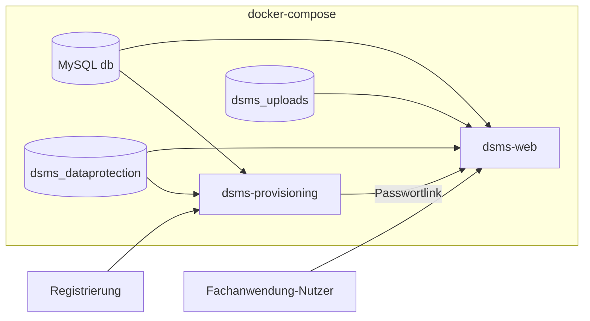

# Production Deployment mit Docker

Diese Anleitung beschreibt, wie **Dsms.Web** (Fachanwendung) und **Dsms.Provisioning** (private Registrierungs-/Provisioning-App) gemeinsam als Open-Source-taugliches Docker-Deployment betrieben werden. Produktive Secrets gehören **nicht** ins Repository oder ins Image, sondern werden über `.env` und Environment Variables gesetzt.

## 1. Ziel

Im Production-Betrieb laufen drei Container:

| Service | Container | Aufgabe |
|---------|-----------|---------|
| `db` | MySQL 8 | Gemeinsame Datenbank für beide Apps |
| `dsms-web` | Dsms.Web | Fachanwendung, **Migrationen**, Uploads |
| `dsms-provisioning` | Dsms.Provisioning | Öffentlicher Signup, Pläne, Provisioning, Welcome-/Legal-Mails |

**Wichtig:**

- Beide Apps nutzen **dieselbe MySQL-Datenbank**.
- Beide Apps teilen **denselben Data-Protection-Key-Ring** (Volume `dsms_dataprotection`, Pfad `/app/DataProtection-Keys`, gleicher `ApplicationName`).
- **Nur Dsms.Web** führt Schema-Migrationen aus (`DatabaseSeeder` → `MigrateAsync()` beim Start).
- **Dsms.Provisioning** führt in Production **keine** Migrationen aus (`Database:RunMigrationsOnStartup=false`).
- Passwortlinks aus Provisioning-Mails zeigen auf die Fachanwendung (`AppUrls:MainAppBaseUrl` / `APP_BASE_URL`).

### Service-Umbenennung

In früheren Versionen hieß der Web-Container-Service `dsms`. Er heißt jetzt **`dsms-web`**, damit er sich von `dsms-provisioning` unterscheidet. Entsprechend wurden die Umgebungsvariablen `DSMS_PORT` → `DSMS_WEB_HTTP_PORT` und `DSMS_IMAGE` → `DSMS_WEB_IMAGE` umbenannt.

## 2. Voraussetzungen

- [Docker](https://docs.docker.com/get-docker/)
- [Docker Compose](https://docs.docker.com/compose/) (in Docker Desktop enthalten)
- MySQL 8 wird **über Docker Compose** gestartet – keine separate MySQL-Installation nötig

Optional für den Image-Build:

- [.NET 9 SDK](https://dotnet.microsoft.com/download) (nur wenn die Images lokal gebaut werden)

## 3. Relevante Dateien

| Datei | Zweck |
|-------|--------|
| `docker-compose.yml` | Startet MySQL, Dsms.Web und Dsms.Provisioning mit Volumes und Environment Variables |
| `.env` | Lokale/produktive Secrets und Einstellungen (**nicht committen**) |
| `.env.example` | Vorlage mit Platzhalterwerten (**im Repository**) |
| `Dsms.Web/Dockerfile` | Multi-Stage Build für die Fachanwendung (Port 8080) |
| `Dsms.Provisioning/Dockerfile` | Multi-Stage Build für die Provisioning-App (Port 8080) |
| `Dsms.Web/appsettings.json` | Basis-Konfiguration mit **lokalem** Development-Fallback |
| `Dsms.Provisioning/appsettings.json` | Basis-Konfiguration mit Platzhaltern (Production-Werte über Env Vars) |

## 4. Warum keine produktiven Secrets in appsettings.json?

`appsettings.json` liegt im Repository und wird ins Docker Image kopiert. Echte Passwörter, API Keys oder produktive Connection Strings wären damit für jeden sichtbar und blieben in Git-Historie und Images erhalten.

Stattdessen:

- `appsettings.json` enthält nur unkritische Defaults und Platzhalter
- Production-Werte kommen aus Environment Variables (über `.env` + `docker-compose.yml`)

## 5. Lokale Entwicklung (ohne vollständiges Compose)

In `Dsms.Web/appsettings.json` und `Dsms.Provisioning/appsettings.json` bleiben lokale Fallbacks für `dotnet run` erhalten.

Nur die Datenbank per Compose starten:

```bash
docker compose up -d db
```

## 6. Production: Connection String per Environment Variable

Im Docker-Production-Betrieb überschreibt diese Variable den lokalen Default in **beiden** Apps:

```
ConnectionStrings__DefaultConnection
```

In `docker-compose.yml` wird der Wert für beide App-Services gesetzt:

```yaml
ConnectionStrings__DefaultConnection: Server=db;Port=3306;Database=${MYSQL_DATABASE};User=${MYSQL_USER};Password=${MYSQL_PASSWORD};CharSet=utf8mb4;
```

## 7. `.env` aus `.env.example` erstellen

```bash
cp .env.example .env        # Linux/macOS
copy .env.example .env      # Windows
```

Dann in `.env` starke Passwörter, öffentliche URLs und SMTP-Platzhalter ersetzen.

**`.env` niemals committen.**

## 8. Environment Variables

### Datenbank

| Variable | Beschreibung |
|----------|----------------|
| `MYSQL_DATABASE` | Datenbankname |
| `MYSQL_USER` | Anwendungsbenutzer für MySQL |
| `MYSQL_PASSWORD` | Passwort des Anwendungsbenutzers |
| `MYSQL_ROOT_PASSWORD` | MySQL-Root-Passwort |
| `MYSQL_PORT` | Host-Port für MySQL (Default: `3306`) |

### Ports

| Variable | Beschreibung |
|----------|----------------|
| `DSMS_WEB_HTTP_PORT` | Host-Port für Dsms.Web (Default: `8081` → Container `8080`) |
| `DSMS_PROVISIONING_HTTP_PORT` | Host-Port für Dsms.Provisioning (Default: `8082` → Container `8080`) |

### Öffentliche URLs

| Variable | Beschreibung |
|----------|----------------|
| `APP_BASE_URL` | Öffentliche URL der Fachanwendung (Passwortlinks, z. B. `https://app.example.com`) |
| `PROVISIONING_BASE_URL` | Öffentliche URL der Provisioning-App (Signup, z. B. `https://signup.example.com`) |

### Data Protection (beide Apps)

| Variable | Compose-Mapping | Beschreibung |
|----------|-----------------|--------------|
| `DATA_PROTECTION_APPLICATION_NAME` | `DataProtection__ApplicationName` | Muss in beiden Apps identisch sein (Default: `DatenschutzCloud`) |

Der Keys-Pfad ist in Compose fest auf `/app/DataProtection-Keys` gesetzt und wird über das Volume `dsms_dataprotection` geteilt.

### Dsms.Web

| Variable | Compose-Mapping | Beschreibung |
|----------|-----------------|--------------|
| `ASPNETCORE_ENVIRONMENT` | `ASPNETCORE_ENVIRONMENT` | z. B. `Production` |
| `ASPNETCORE_URLS` | `ASPNETCORE_URLS` | z. B. `http://+:8080` |
| `DSMS_WEB_IMAGE` | Image-Tag für `dsms-web` | Default: `dsms-web:latest` |
| `STORAGE_UPLOAD_PATH` | `Storage__UploadPath` | Upload-Pfad im Container (Default: `/app/Data/Uploads`) |

**Noch nicht in Dsms.Web implementiert (nur dokumentiert):**

- `AppUrls__SignupAppBaseUrl` – geplanter Verweis auf die externe Signup-App in Login/Navigation
- `Features__PublicSignupEnabled=false` – geplanter Feature-Flag zum Deaktivieren des eingebauten `/signup` in Dsms.Web

Bis diese Konfigurationen existieren, Signup ausschließlich über Dsms.Provisioning betreiben und ggf. `/signup` in Dsms.Web per Reverse Proxy blockieren.

### Dsms.Provisioning

| Variable | Compose-Mapping | Beschreibung |
|----------|-----------------|--------------|
| `DSMS_PROVISIONING_IMAGE` | Image-Tag für `dsms-provisioning` | Default: `dsms-provisioning:latest` |
| `PROVISIONING_PUBLIC_SIGNUP_ENABLED` | `Features__PublicSignupEnabled` | Öffentlichen Signup aktivieren (`true`/`false`) |
| `PROVISIONING_RUN_MIGRATIONS_ON_STARTUP` | `Database__RunMigrationsOnStartup` | In Production **`false`** lassen |
| `PROVISIONING_EMAIL_USE_DATABASE_SETTINGS` | `ProvisioningEmail__UseDatabaseSettings` | `false` = SMTP aus Env Vars |
| `PROVISIONING_EMAIL_ENABLED` | `ProvisioningEmail__Enabled` | E-Mail-Versand aktiv |
| `PROVISIONING_EMAIL_SMTP_HOST` | `ProvisioningEmail__SmtpHost` | SMTP-Server |
| `PROVISIONING_EMAIL_SMTP_PORT` | `ProvisioningEmail__SmtpPort` | SMTP-Port (Default: `587`) |
| `PROVISIONING_EMAIL_ENCRYPTION` | `ProvisioningEmail__Encryption` | z. B. `StartTls` |
| `PROVISIONING_EMAIL_SMTP_USERNAME` | `ProvisioningEmail__SmtpUsername` | SMTP-Benutzer |
| `PROVISIONING_EMAIL_SMTP_PASSWORD` | `ProvisioningEmail__SmtpPassword` | SMTP-Passwort (**nur in `.env`**) |
| `PROVISIONING_EMAIL_SENDER_EMAIL` | `ProvisioningEmail__SenderEmail` | Absender-Adresse |
| `PROVISIONING_EMAIL_SENDER_NAME` | `ProvisioningEmail__SenderName` | Absender-Anzeigename |
| `PROVISIONING_EMAIL_TIMEOUT_SECONDS` | `ProvisioningEmail__TimeoutSeconds` | SMTP-Timeout |

SMTP für die **Fachanwendung** (Passwort-Reset, Mandanten-Mails) wird weiterhin über die DSMS-Oberfläche unter `/platform/email/settings` in der Datenbank gepflegt (verschlüsselt via Data Protection).

## 9. Docker Volumes

| Volume | Mount im Container | Inhalt |
|--------|-------------------|--------|
| `dsms_mysql_data` | `/var/lib/mysql` (db) | MySQL-Datenbankdateien |
| `dsms_uploads` | `/app/Data/Uploads` (dsms-web) | Hochgeladene Nachweisdokumente |
| `dsms_dataprotection` | `/app/DataProtection-Keys` (beide Apps) | ASP.NET Data Protection Keys (Login, Tokens, SMTP-Verschlüsselung) |

Ohne persistente Volumes gehen Daten bei Container-Neustarts oder Image-Updates verloren.

## 10. System starten

```bash
docker compose up -d
```

Nur die Datenbank (z. B. für lokales `dotnet run`):

```bash
docker compose up -d db
```

**Erster Start:** Dsms.Web führt Migrationen und Seeding automatisch beim Start aus. Dsms.Provisioning startet danach und nutzt das bereits migrierte Schema.

Erreichbarkeit (Default-Ports aus `.env.example`):

- Fachanwendung: `http://localhost:8081`
- Provisioning / Signup: `http://localhost:8082`

In Production HTTPS über einen **Reverse Proxy** (nginx, Traefik, Caddy) vor den Containern terminieren und `APP_BASE_URL` / `PROVISIONING_BASE_URL` auf die HTTPS-URLs setzen.

## 11. Logs ansehen

```bash
docker compose logs -f dsms-web
docker compose logs -f dsms-provisioning
docker compose logs -f db
```

## 12. Updates einspielen

**Bei lokalem Build:**

```bash
docker compose build dsms-web dsms-provisioning
docker compose up -d
```

**Bei Images aus Registry (z. B. Docker Hub):**

In `.env` die Image-Namen setzen:

```env
DSMS_WEB_IMAGE=ihr-benutzername/dsms-web:latest
DSMS_PROVISIONING_IMAGE=ihr-benutzername/dsms-provisioning:latest
```

Dann:

```bash
docker compose pull dsms-web dsms-provisioning
docker compose up -d
```

## 13. Backups

Regelmäßig sichern:

1. **MySQL-Volume** (`dsms_mysql_data`) – alle Anwendungsdaten beider Apps
2. **Upload-Volume** (`dsms_uploads`) – hochgeladene Dateien der Fachanwendung
3. **Data-Protection-Volume** (`dsms_dataprotection`) – ohne diese Keys sind verschlüsselte SMTP-Passwörter, Auth-Cookies und Passwort-Reset-Token nach Neustart ggf. ungültig

Beispiel (Volume-Pfad ermitteln):

```bash
docker volume inspect dsms_mysql_data
```

Für produktive Umgebungen empfiehlt sich zusätzlich ein dediziertes MySQL-Backup (z. B. `mysqldump`).

## 14. Sicherheitshinweise

- Starke, eindeutige Passwörter in `.env` verwenden
- `.env` **nicht** ins Repository committen (steht in `.gitignore`)
- `appsettings.Production.json` mit echten Secrets **nicht** committen
- HTTPS über Reverse Proxy vor beiden App-Containern
- MySQL-Port (`3306`) in Production ggf. nicht nach außen veröffentlichen
- Provisioning-SMTP-Zugangsdaten nur in `.env` / Secret-Store, nicht im Repository
- Falls früher echte Secrets committed wurden: aus Git-Historie entfernen und betroffene Passwörter rotieren

## 15. Images bauen und veröffentlichen

```bash
docker build -f Dsms.Web/Dockerfile -t ihr-benutzername/dsms-web:latest .
docker build -f Dsms.Provisioning/Dockerfile -t ihr-benutzername/dsms-provisioning:latest .

docker push ihr-benutzername/dsms-web:latest
docker push ihr-benutzername/dsms-provisioning:latest
```

Die Images enthalten:

- `appsettings.json` mit lokalen Development-Fallbacks
- **keine** `.env`
- **keine** produktiven Secrets
- **keine** Upload-Dateien

## 16. Architektur (Überblick)


