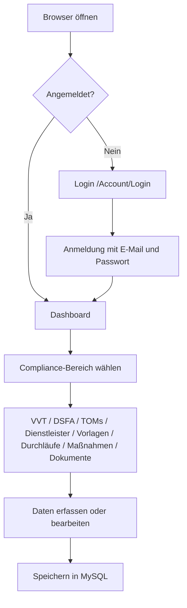

# DSMS – Projektübersicht

## Zweck des Projekts

**DSMS** (Datenschutz-Management-System) ist eine webbasierte Anwendung zur Unterstützung von Datenschutz-Compliance-Arbeit in Organisationen. Das System hilft dabei,

- **Audit-Vorlagen** mit Prüffragen zu pflegen,
- **Audit-Durchläufe** durchzuführen und Antworten zu dokumentieren,
- **Maßnahmen** aus Audits oder eigenständig zu verfolgen,
- **Nachweisdokumente** hochzuladen und zuzuordnen,
- einen **Überblick** über offene Maßnahmen und laufende Audits zu erhalten.

Im README wird das Projekt als **Version 1** und als **einfaches Grundgerüst** beschrieben – kein vollständiges Enterprise-Datenschutzmanagementsystem.

## Zielgruppe

**Primäre Zielgruppen:**
- Managed Service Provider (MSP), die Datenschutz als Service anbieten
- Kleine und mittlere Unternehmen (KMU), die ihre Datenschutzpflichten strukturiert umsetzen möchten
- Vereine und Organisationen mit einfachen, aber dennoch DSGVO-relevanten Anforderungen
- Externe und interne Datenschutzbeauftragte zur Verwaltung mehrerer Mandanten und Audits

**Ziel des Systems:**
Das System dient als zentrales Datenschutzmanagementsystem (DSMS), mit dem gesetzliche Anforderungen (z. B. DSGVO) effizient dokumentiert, verwaltet und nachverfolgt werden können.

**Kernnutzen:**
- Strukturierte Dokumentation (z. B. Verarbeitungsverzeichnis, TOMs, Dienstleister)
- Unterstützung bei Audits und Nachweisen
- Zentrale Verwaltung mehrerer Mandanten (besonders relevant für MSP und Datenschutzbeauftragte)
- Selfhosting-fähig sowie perspektivisch als SaaS verfügbar

**Positionierung:**
Das System ist als Open Source Lösung (AGPL v3) konzipiert und soll sowohl:
- frei selbst betrieben (Selfhosted via Docker)
- als auch als kommerzielle SaaS-Lösung angeboten werden

**Abgrenzung:**
Das System richtet sich bewusst nicht an Großkonzerne oder hochkomplexe Enterprise-Compliance-Plattformen, sondern an pragmatische, umsetzungsorientierte Anwender.

## Hauptfunktionen (aktueller Stand)

| Bereich | Funktion |
|--------|----------|
| Dashboard | Kennzahlen zu Maßnahmen, Audits, TOMs, Dienstleistern, DSFA und VVT-Verknüpfungen sowie Kurzlisten (mandantenbezogen) |
| Verarbeitungstätigkeiten | Verzeichnis von Verarbeitungstätigkeiten (VVT) – Listen, Detail als zentrale Verknüpfungsübersicht, Verknüpfungen pflegen, Stammdaten |
| DSFA | Datenschutz-Folgenabschätzungen – Listen, Detail, Anlegen/Bearbeiten; Zuordnung zu Verarbeitungstätigkeiten |
| TOM-Verzeichnis | Technische und organisatorische Maßnahmen – Listen, Detail, Anlegen/Bearbeiten; Verknüpfung mit Verarbeitungstätigkeiten |
| Dienstleister | Auftragsverarbeiter und externe Dienstleister – AVV, Drittland, TOM-Prüfung; Verknüpfung mit VVT und TOMs |
| Audit-Vorlagen | Eigene, offizielle und Community-Vorlagen; Einreichung zur Community-Prüfung; Listen, Anlegen, Bearbeiten/Ansehen inkl. Fragen |
| Audit-Durchläufe | Listen, Anlegen und Bearbeiten von Durchläufen; Beantwortung der Vorlagenfragen |
| Maßnahmen | Listen, Anlegen und Bearbeiten von Maßnahmen mit Status und Fälligkeit; direkt aus Auditfragen bei Handlungsbedarf |
| Dokumente | Upload von Nachweisdateien (max. 10 MB), Zuordnung zu Audit, Maßnahme, Dienstleister oder Verarbeitungstätigkeit |
| Mandanten | Verwaltung von Organisationseinheiten (**nur Superuser**, plattformweit) |
| Benutzer | Anlegen und Bearbeiten von Konten, Rollen, Mandant, Aktiv-Status (**Superuser** mandantenübergreifend, **Admin** nur im eigenen Mandant) |
| Tenant-Daten | Vollständiger Mandanten-Export als ZIP und sichere Löschanforderung (**Superuser** und **Admin**) |
| Email | Zentrale SMTP-Einstellungen und Email-Vorlagen (**nur Superuser**); Testmail und Vorschau |
| Benutzer | Anlegen (ohne Passwort, mit Willkommensmail) und Bearbeiten von Konten, Rollen, Mandant, Aktiv-Status (**Superuser** mandantenübergreifend, **Admin** nur im eigenen Mandant) |
| Erinnerungen | Fällige Datenschutz-Themen prüfen und Sammelmail an Mandanten-Admins senden (**nur Superuser**) |
| Konto | Standard-Identity-Funktionen (Profil, Passwort, optional 2FA usw.) |

## Module und Seiten

### Compliance (alle angemeldeten Benutzer mit zugeordnetem Mandanten)

| Route | Seite | Kurzbeschreibung |
|-------|-------|------------------|
| `/` | Dashboard | Übersicht Kennzahlen und Listen |
| `/processing-activities` | Verarbeitungstätigkeiten (Liste) | VVT-Einträge des eigenen Mandanten |
| `/processing-activities/{Id}` | Verarbeitungstätigkeit (Detail) | Zentrale Übersicht inkl. Verknüpfungen und Warnhinweise; alle angemeldeten Benutzer mit Mandant |
| `/processing-activities/links/{Id}` | Verknüpfungen bearbeiten | Nur **Admin** und **Auditor** |
| `/processing-activities/edit` | Verarbeitungstätigkeit anlegen | Nur **Admin** und **Auditor** |
| `/processing-activities/edit/{Id}` | Verarbeitungstätigkeit bearbeiten (Stammdaten) | Nur **Admin** und **Auditor** |
| `/dsfa` | DSFA (Liste) | Alle angemeldeten Benutzer mit Mandant |
| `/dsfa/{Id}` | DSFA (Detail) | Alle angemeldeten Benutzer mit Mandant |
| `/dsfa/edit` | DSFA anlegen | Nur **Admin** und **Auditor** |
| `/dsfa/edit/{Id}` | DSFA bearbeiten | Nur **Admin** und **Auditor** |
| `/toms` | TOM-Verzeichnis (Liste) | TOMs des eigenen Mandanten |
| `/toms/{Id}` | TOM (Detail) | Inkl. verknüpfte Verarbeitungstätigkeiten; alle angemeldeten Benutzer mit Mandant |
| `/toms/edit` | TOM anlegen | Nur **Admin** und **Auditor** |
| `/toms/edit/{Id}` | TOM bearbeiten | Nur **Admin** und **Auditor**; Zuordnung zu Verarbeitungstätigkeiten |
| `/service-providers` | Dienstleister (Liste) | Dienstleister des eigenen Mandanten |
| `/service-providers/{Id}` | Dienstleister (Detail) | Alle angemeldeten Benutzer mit Mandant |
| `/service-providers/edit` | Dienstleister anlegen | Nur **Admin** und **Auditor** |
| `/service-providers/edit/{Id}` | Dienstleister bearbeiten | Nur **Admin** und **Auditor**; Zuordnung zu VVT und TOMs |
| `/audit-templates` | Audit-Vorlagen (Liste) | Eigene Vorlagen des Mandanten + offizielle Vorlagen; Badge „Eigene Vorlage“ / „Offiziell“; Superuser sieht zusätzlich „Neue globale Vorlage“ |
| `/audit-templates/edit` | Mandantenvorlage anlegen | **Admin**/**Auditor** und **Superuser** (Vorlage im aktuell ausgewählten Mandanten) |
| `/audit-templates/edit?type=official` | Globale/offizielle Vorlage anlegen | Nur **Superuser**; `TenantId` bleibt null trotz Mandantenkontext |
| `/audit-templates/edit/{Id}` | Vorlage bearbeiten oder ansehen + Fragen | Fragen hinzufügen/bearbeiten/löschen nur bei bearbeitbarer Vorlage; offizielle/Community nur **Superuser** |
| `/platform/audit-templates/community` | Community-Einreichungen prüfen (Liste) | Nur **Superuser** |
| `/platform/audit-templates/community/{Id}` | Einreichung freigeben oder ablehnen | Nur **Superuser** |
| `/audit-runs` | Audit-Durchläufe (Liste) | Durchläufe des eigenen Mandanten |
| `/audit-runs/edit` | Durchlauf anlegen | Nur **Admin** und **Auditor** |
| `/audit-runs/edit/{Id}` | Durchlauf bearbeiten (Status, Vorlage) | Nur **Admin** und **Auditor** |
| `/audit-runs/answers/{Id}` | Fragen beantworten; bei Handlungsbedarf „+ Maßnahme anlegen“ | Alle angemeldeten Benutzer |
| `/measures` | Maßnahmen (Liste); optional gefiltert per `?auditAnswerId=` | Mandantenbezogen |
| `/measures/edit` | Maßnahme anlegen; optional vorausgefüllt per `?auditRunId=&auditAnswerId=` | Alle angemeldeten Benutzer |
| `/measures/edit/{Id}` | Maßnahme bearbeiten | Alle angemeldeten Benutzer |
| `/documents` | Dokumente | Upload und Liste, mandantenbezogen |

### Plattformverwaltung (nur Rolle **Superuser**)

| Route | Seite |
|-------|-------|
| `/tenants` | Mandanten (Liste) |
| `/tenants/edit` | Mandant anlegen |
| `/tenants/edit/{Id}` | Mandant bearbeiten |
| `/platform/email/settings` | Email-Einstellungen (SMTP, Testmail) |
| `/platform/email/templates` | Email-Vorlagen (Liste) |
| `/platform/email/templates/edit/{Id}` | Email-Vorlage bearbeiten (Vorschau, Testmail) |

### Benutzerverwaltung (**Superuser** und **Admin**)

| Route | Seite | Zugriff |
|-------|-------|---------|
| `/users` | Benutzer (Liste) | Superuser: alle Mandanten; Admin: nur eigener Mandant |
| `/users/create` | Benutzer anlegen | Superuser: Rolle + Mandant; Admin: Rolle ohne Superuser, Mandant automatisch |
| `/users/edit/{UserId}` | Benutzer bearbeiten | Wie Liste; Admin darf keine Superuser bearbeiten |
| `/tenant-daten` | Tenant-Daten | Export als ZIP und Löschanforderung; Superuser: aktuell gewählter Mandant; Admin: nur eigener Mandant |

Der Mandanten-Export enthält fachliche Daten und Dokumente des aktuellen Mandanten, **keine** Passwort-Hashes, Tokens oder Secrets. Die Löschanforderung markiert den Mandanten nur als „Löschung angefordert“ – eine endgültige Löschung folgt später in einem separaten Prozess.
| `/admin/erinnerungen` | Erinnerungen | Nur Superuser; alle Mandanten; manueller Versand mit Vorschau |

### Konto und Anmeldung

| Route | Hinweis |
|-------|---------|
| `/Account/Login` | Anmeldung (eigenes Layout ohne Sidebar); Link „Passwort vergessen?“ |
| `/passwort-vergessen` | Passwortreset anfordern (Self-Service, neutrale Meldung) |
| `/passwort-zuruecksetzen` | Neues Passwort setzen (Identity-Token per Query) |
| `/Account/Manage` und Unterseiten | Profil, Passwort, 2FA, persönliche Daten (Standard-Identity-Vorlagen, teils englische UI-Texte) |
| `/Account/Register` | Registrierung vorhanden, aber **nicht** in der Login-Seite verlinkt |
| `/not-found` | Seite nicht gefunden |

## Wichtige fachliche Begriffe

| Begriff | Bedeutung im System |
|--------|---------------------|
| **Mandant (Tenant)** | Organisationseinheit; Daten werden primär nach `TenantId` getrennt |
| **Audit-Vorlage** | Wiederverwendbarer Fragenkatalog; **Eigene Vorlage**, **Offiziell** (Plattform) oder **Community** (vom Mandanten eingereicht und freigegeben) |
| **Audit-Frage** | Einzelne Prüffrage in einer Vorlage (Sortierung, Kategorie, Pflichtfeld) |
| **Audit-Durchlauf** | Konkretes Audit auf Basis einer Vorlage mit Lebenszyklus-Status |
| **Audit-Antwort** | Antwort zu einer Frage innerhalb eines Durchlaufs inkl. Compliance-Bewertung |
| **Compliance-Bewertung** | Einschätzung: Offen, Compliant, Partial, NonCompliant, NotApplicable |
| **Verarbeitungstätigkeit** | Eintrag im Verzeichnis von Verarbeitungstätigkeiten (VVT) zu einer konkreten Datenverarbeitung |
| **TOM** | Technische oder organisatorische Maßnahme zum Schutz von Verarbeitungstätigkeiten |
| **Dienstleister** | Externe Stelle (Auftragsverarbeiter oder sonstiger Dienstleister) mit AVV- und Risikodokumentation |
| **DSFA** | Datenschutz-Folgenabschätzung zu einer Verarbeitungstätigkeit (Risiken, Maßnahmen, Restrisiko, Ergebnis) |
| **Maßnahme** | Aufgabe zur Umsetzung (optional verknüpft mit einem Audit-Durchlauf) |
| **Nachweisdokument** | Metadaten zu einer hochgeladenen Datei (Inhalt im Dateisystem) |
| **Rollen** | **Superuser** (plattformweit), **Admin** (Mandant), **Auditor**, **User** – steuern Menü und serverseitige Prüfungen |
| **Superuser** | SaaS-Betreiber: alle Mandanten und Benutzer, keine Pflicht-Mandantenzuordnung (`TenantId` null) |
| **Admin** | Mandanten-Administrator: nur eigener `TenantId`, Benutzerverwaltung ohne Superuser-Rolle |

### Statuswerte (im UI oft englische Enum-Namen)

- **Audit-Durchlauf:** Draft, InProgress, Completed  
- **Maßnahme:** Open, InProgress, Done, Cancelled  
- **Verarbeitungstätigkeit:** Entwurf, Aktiv, In Prüfung, Archiviert (im Code `ProcessingActivityStatus`)  
- **TOM-Umsetzungsstatus:** Geplant, In Umsetzung, Umgesetzt, In Prüfung, Nicht umgesetzt, Nicht anwendbar (im Code `TomImplementationStatus`, Labels via `TomLabels`)

## Modul TOM-Verzeichnis

**Zweck:** Dokumentation technischer und organisatorischer Maßnahmen (TOMs), mit denen Verarbeitungstätigkeiten abgesichert werden – mandantenbezogen im DSMS.

**Benutzerfunktionen:**

- Liste aller TOMs mit Kategorie, Schutzziel, Umsetzungsstatus, Verantwortlichem, nächster Prüfung und Anzahl verknüpfter Verarbeitungstätigkeiten
- Detailansicht inkl. verknüpfter Verarbeitungstätigkeiten (Links ins VVT)
- Anlegen und Bearbeiten (Admin/Auditor) inkl. Checkbox-Zuordnung zu Verarbeitungstätigkeiten des eigenen Mandanten
- Freitextfeld „Nachweis / Referenz“ für manuelle Nachweisdokumentation

**Verknüpfung:** Many-to-Many über `ProcessingActivityToms` – eine TOM kann mehreren Verarbeitungstätigkeiten zugeordnet sein und umgekehrt. Verknüpfungen sind mandantengebunden (`TenantId` auf der Zwischentabelle).

**Bekannte Einschränkungen / offene Punkte:**

- Kein Löschen von TOMs über die UI
- Nachweisdokumente können noch **nicht** direkt an TOMs angehängt werden (Dokumentenmodul unterstützt nur Audit-Durchlauf und Maßnahme)

## Modul Verknüpfungen (Verarbeitungstätigkeit)

**Zweck:** Die Verarbeitungstätigkeit ist der zentrale Einstiegspunkt für zugehörige Datenschutzinformationen (TOMs, Dienstleister, Dokumente, Maßnahmen, Audit-Antworten, DSFA-Status).

**Benutzerfunktionen:**

- Detailseite mit Abschnitten und kompakten Tabellen inkl. Links zu Detailobjekten
- Warnhinweise (z. B. keine TOMs, fehlender AVV, offene/überfällige Maßnahmen, problematische Audit-Bewertungen, DSFA erforderlich)
- Seite „Verknüpfungen bearbeiten“ für Admin/Auditor (Checkbox-Zuordnungen)
- Anzeige für alle angemeldeten Benutzer mit Mandant; Bearbeitung nur Admin/Auditor

**Verknüpfungen:**

- TOMs und Dienstleister: bestehende Many-to-Many-Tabellen
- Dokumente: `EvidenceDocument.ProcessingActivityId`
- Maßnahmen: `ProcessingActivityMeasures`
- Audit-Antworten: `ProcessingActivityAuditAnswers` (Many-to-Many)
- DSFA: 1:n über `DataProtectionImpactAssessment`; Übersicht und Warnhinweise auf der VVT-Detailseite

**Bekannte Einschränkungen / offene Punkte:**

- Kein Dokumenten-Download
- Audit-Antwort-Zuordnung nicht in der Antwortmaske, nur über Verknüpfungsseite
- Dienstleister-Rolle in der Verarbeitung wird bei Zuordnung von der VVT-Seite nicht bearbeitet

## Modul DSFA

**Zweck:** Strukturierte Dokumentation von Datenschutz-Folgenabschätzungen (DSFA) zu Verarbeitungstätigkeiten – inkl. Risiken, Schutzmaßnahmen, Restrisiko, Ergebnis und Prüfstatus.

**Benutzerfunktionen:**

- Liste aller DSFAs des Mandanten mit Verarbeitungstätigkeit, Status, Restrisiko, Ergebnis und Prüfterminen
- Detailansicht mit fachlichen Textfeldern, verknüpfter Verarbeitungstätigkeit und zugeordneten Nachweisdokumenten
- Anlegen und Bearbeiten (Admin/Auditor) mit Auswahl der Verarbeitungstätigkeit (nur eigener Mandant)
- VVT-Detailseite: DSFA-Kennzahlen, neueste DSFA, Warnhinweise, Schnellanlage mit vorausgefüllter Verarbeitungstätigkeit
- Einfache Warnhinweise (z. B. DSFA-Pflicht ohne Eintrag, hohes Restrisiko, überfällige Prüfung, kritisches Ergebnis)

**Verknüpfung:** Pflicht-FK `ProcessingActivityId` (1:n). Nachweisdokumente optional über `EvidenceDocument.DataProtectionImpactAssessmentId`.

**Berechtigungen:** Alle angemeldeten Benutzer mit Mandant dürfen lesen; Admin und Auditor dürfen anlegen und bearbeiten.

**Bekannte Einschränkungen / offene Punkte:**

- `DpiaRequired` an der Verarbeitungstätigkeit ist nur Ja/Nein (kein „Zu prüfen“)
- Kein Löschen von DSFA über die UI
- Keine DSFA-Versionierung oder Freigabe-Workflow-Engine

## Modul Dienstleister / Auftragsverarbeiter

**Zweck:** Mandantenbezogene Dokumentation externer Dienstleister und Auftragsverarbeiter – inkl. AVV, TOM-Prüfung, Drittlandbezug, Unterauftragsverarbeiter und Verknüpfung zu Verarbeitungstätigkeiten.

**Benutzerfunktionen:**

- Liste mit Name, Art, Status, Auftragsverarbeiter-Kennzeichen, AVV, Drittland, Risiko, Verantwortlichem
- Detailansicht: Stammdaten, AVV, TOM-Prüfung, Drittland, Unterauftragsverarbeiter, verknüpfte VVT-Einträge (mit Rolle), verknüpfte TOMs, zugeordnete Nachweisdokumente
- Anlegen/Bearbeiten (Admin/Auditor) mit Zuordnung zu Verarbeitungstätigkeiten (Rolle pro Verknüpfung) und TOMs
- Einfache Plausibilitätshinweise (z. B. fehlender AVV bei aktivem Auftragsverarbeiter, überfällige AVV-Prüfung)
- Dashboard-Kennzahlen zu Dienstleistern

**Verknüpfungen:**

- Many-to-Many zu Verarbeitungstätigkeiten über `ProcessingActivityServiceProviders` (inkl. `RoleInProcessing`, `TenantId`)
- Many-to-Many zu TOMs über `ServiceProviderToms`
- Nachweisdokumente optional über `EvidenceDocument.ServiceProviderId` (Upload auf Seite Dokumente)

**Bekannte Einschränkungen / offene Punkte:**

- Kein Löschen von Dienstleistern über die UI
- Kein Download von Nachweisdokumenten in der UI
- TOMs können weiterhin nicht direkt im Dokumentenmodul verknüpft werden (nur über Dienstleister oder Freitext)

## Aktueller Funktionsumfang

### Was das System kann

- Anmeldung per E-Mail und Passwort (ASP.NET Core Identity)
- Mandantenbezogene Datenfilterung über `TenantId` des Benutzers
- Demo-Daten und Demo-Benutzer beim ersten Start (leere Datenbank)
- Automatische Datenbankmigration beim Start
- CRUD-ähnliche Bearbeitung für Verarbeitungstätigkeiten (VVT), DSFA, TOMs, Dienstleister, Vorlagen, Durchläufe, Maßnahmen, Mandanten (ohne Löschen in der UI)
- TOM-Verzeichnis mit Verknüpfung zu Verarbeitungstätigkeiten und Dashboard-Kennzahlen zu TOMs
- Dienstleister-Verzeichnis mit AVV-/Drittland-Dokumentation, VVT- und TOM-Verknüpfung, Dashboard-Kennzahlen
- Nachweisdokumente optional einem Dienstleister zuordenbar
- Datei-Upload mit Mandantenordner unter `Data/Uploads/`
- Rollenbasierte Navigation und Seitenautorisierung
- Zentraler Emailservice (Superuser): globale SMTP-Einstellungen, Email-Vorlagen mit Platzhaltern `{{VariableName}}`, Vorschau und Testmail
- Passwortreset (ASP.NET Identity): Self-Service über „Passwort vergessen?“; Admin/Superuser können Reset-Mails aus der Benutzerverwaltung auslösen
- Benutzeranlage ohne Passwort: Willkommensmail mit Einladungslink (Identity-Token, 60 Min.); Passwort festlegen über `/passwort-zuruecksetzen?mode=invite`
- Erinnerungen (manuell): DSFA/TOM/AVV/Maßnahmen/Audit-Inaktivität; Sammelmail pro Mandant an Admins

### Was das System (noch) nicht kann

- Löschen von Fachdatensätzen über die UI (Mandanten, Vorlagen, Durchläufe, Maßnahmen, Verarbeitungstätigkeiten, TOMs, Dienstleister, Dokumente)
- Upload von Nachweisdokumenten mit direkter Zuordnung zu TOMs
- Herunterladen hochgeladener Nachweisdokumente über die Dokumenten-Seite
- Mandantenwechsel im UI für Compliance-Daten (Superuser ohne `TenantId` sieht kein mandantenbezogenes Dashboard)
- Bearbeiten oder Löschen einzelner Audit-Fragen nach dem Anlegen
- Zuweisung von Verantwortlichen (`AssignedUserId`) in der UI – Feld existiert im Datenmodell
- Vollständige Email-Workflows für Benutzer-Einladung und Erinnerungen – Vorlagen sind vorbereitet, Workflows folgen später
- Email-Versandprotokoll (EmailLog) – bewusst noch nicht enthalten
- Öffentliche Selbstregistrierung als Standard-Workflow (Register-Seite existiert, ist aber nicht eingebunden)
- Mehrere Mandanten pro Benutzer (geplant; aktuell genau ein `TenantId` pro Konto, außer Superuser)
- Rollen pro Mandant und Impersonation (geplant)

## Geplante oder offene Funktionen (aus Code/README)

- README: **„Keine Enterprise-Mandantenisolation“** – einfache Zuordnung per `TenantId`, keine Claims-basierte Mandantenlogik
- README: **„Version 1“** – impliziert Weiterentwicklung, ohne konkrete Roadmap im Code
- Kommentar in `Program.cs`: Demo/Intern – sofortiger Login ohne E-Mail-Bestätigung
- Kommentar in `Users/Edit.razor`: **eine Rolle pro Benutzer** in Version 1

## Verwendete Technologien

| Technologie | Verwendung |
|-------------|------------|
| **C# / .NET 9** | Laufzeit und Web-Framework |
| **Blazor Server** | UI mit interaktivem Server-Rendermodus (`InteractiveServer`) |
| **ASP.NET Core Identity** | Benutzer, Rollen, Anmeldung |
| **Entity Framework Core 9** | Datenbankzugriff und Migrationen |
| **Pomelo.EntityFrameworkCore.MySql** | MySQL-Anbindung |
| **MySQL 8** | Datenbank (lokal oder per Docker Compose) |
| **Bootstrap** | Basis-Styling; zusätzlich eigenes DSMS-CSS |

## Grundlegender Ablauf für Benutzer

1. Anwendung starten (`dotnet run` in `Dsms.Web` oder Visual Studio).
2. Beim ersten Start: Migrationen und optional Demo-Daten (Mandant „Demo GmbH“, Beispiel-Audit, drei Benutzer).
3. Mit Demo-Zugangsdaten anmelden (siehe README).
4. Im Dashboard den Überblick nutzen und in die Module wechseln.
5. **Auditor/Admin:** Verarbeitungstätigkeiten (VVT), Vorlagen und Durchläufe anlegen und pflegen.
6. **Alle Rollen:** Audit-Fragen beantworten, Maßnahmen pflegen, Dokumente hochladen.
7. **Superuser:** Mandanten und alle Benutzer verwalten; **Admin:** nur Benutzer des eigenen Mandanten.
8. Abmelden über die Sidebar (POST an `/Account/Logout`).

### Demo-Zugänge (aus `DatabaseSeeder` / README)

| E-Mail | Passwort | Rolle |
|--------|----------|-------|
| superuser@demo.local | Demo123! | Superuser |
| admin@demo.local | Demo123! | Admin |
| auditor@demo.local | Demo123! | Auditor |
| user@demo.local | Demo123! | User |

## Bekannte Einschränkungen und offene Punkte

- **Mandantentrennung:** Filterung erfolgt in den Razor-Seiten per `ICurrentUserContext.GetTenantIdAsync()` – keine zentrale Datenzugriffsschicht; **Noch zu klären:** Schutz vor Manipulation von URLs/IDs über andere Mandanten (teilweise durch `TenantId`-Filter in Queries abgesichert).
- **Superuser und Compliance:** Superuser haben keinen Mandanten – Compliance-Module nutzen weiterhin `TenantId` des Benutzers; Plattformverwaltung über eigene Menüpunkte.
- **Ein Mandant pro Benutzer (V1):** `ApplicationUser.TenantId`; spätere Erweiterung über separate Zuordnungstabelle vorgesehen.
- **UI-Sprache:** Fachseiten überwiegend deutsch; viele Identity-Standardseiten noch englisch.
- **Enum-Anzeige:** Status und Compliance-Stufen erscheinen im UI als englische Enum-Namen.
- **Dokumente:** Kein Download-Link in der Dokumentenliste.
- **Hochladen:** Maximale Dateigröße 10 MB.
- **Lizenz:** README verweist auf „internes Projekt“ – **Noch zu klären:** formale Lizenzierung.

## Projektbestandteile im Repository

- `Dsms.sln` – Visual-Studio-Lösung mit einem Projekt
- `Dsms.Web/` – Blazor-Server-Webanwendung
- `docker-compose.yml` – MySQL 8 und DSMS-App für Production (siehe `Production_Deployment.md`)
- `README.md` – Schnellstart und Entwicklerhinweise (bestehend, unverändert durch diese Dokumentation)
