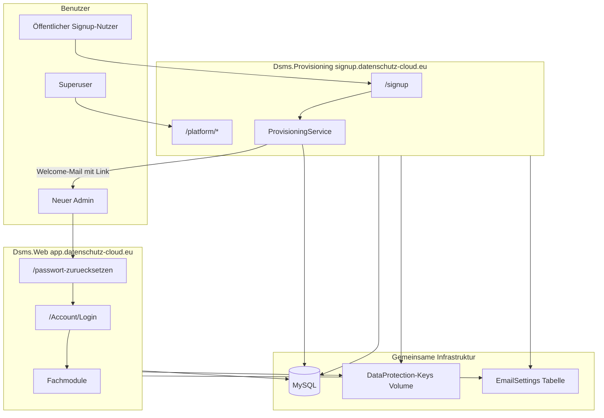
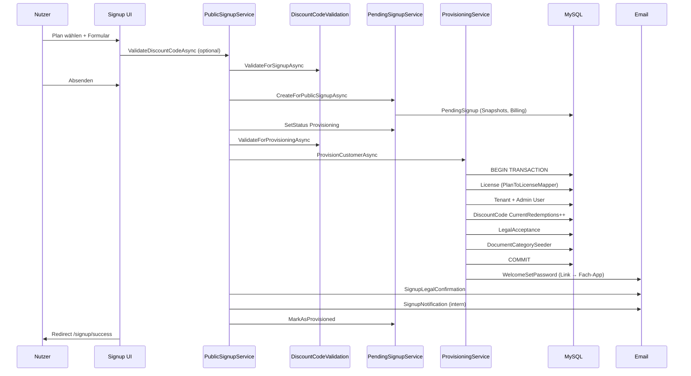

# Provisioning-Extraktion – Dsms.Provisioning

> **Stand:** 2026-06-15  
> **Bezug:** [`OpenSource_Readiness.md`](./OpenSource_Readiness.md)  
> **Zweck:** Detaillierter Plan zur Auslagerung der privaten Provisioning-App aus der bestehenden Fachanwendung `Dsms.Web`.  
> **Hinweis:** Dieses Dokument ist eine technische Architektur- und Umsetzungsplanung. Keine Rechtsberatung. In diesem Schritt wurden **keine Codeänderungen** vorgenommen.

---

## Executive Summary

Die SaaS-Funktionen (Public Signup, Pläne, Rabattcodes, PendingSignups, Provisioning, kaufmännische Lizenzanlage) werden in ein **privates Repository** `datenschutz-cloud-provisioning` mit der Blazor-Server-App **`Dsms.Provisioning`** ausgelagert.

**V1-Grundentscheidung:** Direkter Zugriff auf **dieselbe MySQL-Datenbank** wie `Dsms.Web` – **keine REST-API** zwischen den Apps.

| Aspekt | V1-Entscheidung |
|--------|-----------------|
| Datenbank | Gemeinsame MySQL-Instanz / gleicher Connection String |
| Migrationen | **Nur `Dsms.Web`** führt `Database.Migrate()` aus |
| Provisioning-App Production | **Keine** automatischen Migrationen |
| Code-Duplizierung | **Erlaubt** (Email, Logging, Identity-Helfer) |
| Identity | Gleiche Tabellen (`AspNetUsers`, Rollen) |
| Passwort-Link | Zeigt auf **Fachanwendung** (`AppUrls:MainAppBaseUrl`) |
| Data Protection | **Gemeinsames Key-Volume + gleicher ApplicationName** |

---

## Inhaltsverzeichnis

1. [Zielarchitektur der privaten Provisioning-App](#1-zielarchitektur-der-privaten-provisioning-app)
2. [Routen, die in die Provisioning-App wandern](#2-routen-die-in-die-provisioning-app-wandern)
3. [Routen, die in der Fachanwendung bleiben](#3-routen-die-in-der-fachanwendung-bleiben)
4. [Services, die in die Provisioning-App wandern](#4-services-die-in-die-provisioning-app-wandern)
5. [Services, die in beiden Apps benötigt werden](#5-services-die-in-beiden-apps-benötigt-werden)
6. [Services, die nicht in Provisioning-App sollen](#6-services-die-nicht-in-provisioning-app-sollen)
7. [Entities und DbContext-Anforderungen](#7-entities-und-dbcontext-anforderungen)
8. [Migrationen und Datenbankstrategie](#8-migrationen-und-datenbankstrategie)
9. [Identity, Rollen und Superuserlogin](#9-identity-rollen-und-superuserlogin)
10. [Passwortvergabe-Link für den ersten Admin](#10-passwortvergabe-link-für-den-ersten-admin)
11. [E-Mail in Provisioning-App](#11-e-mail-in-provisioning-app)
12. [Legal in Provisioning-App](#12-legal-in-provisioning-app)
13. [Billing, Pläne, Rabattcodes](#13-billing-pläne-rabattcodes)
14. [Kopplungen vor dem Entfernen lösen](#14-kopplungen-vor-dem-entfernen-lösen)
15. [Empfohlene Projektstruktur Dsms.Provisioning](#15-empfohlene-projektstruktur-für-dsmsprovisioning)
16. [Docker- und Deployment-Zielbild](#16-docker--und-deployment-zielbild)
17. [Testplan](#17-testplan)
18. [Risiken und offene Entscheidungen](#18-risiken-und-offene-entscheidungen)
19. [Empfohlene Umsetzung in Phasen](#19-empfohlene-umsetzung-in-phasen)
20. [Spätere Alternativen (V2+)](#20-spätere-alternativen-v2)

---

## 1. Zielarchitektur der privaten Provisioning-App

### 1.1 Repository-Struktur (Ziel)

```
datenschutz-cloud-provisioning/          # Privates Git-Repo
├── README.md
├── Provisioning_App_Architecture.md
├── docker-compose.yml                 # App + optional lokale DB für Dev
├── .env.example
├── Dsms.Provisioning/
│   ├── Dsms.Provisioning.csproj
│   ├── Dockerfile
│   ├── Program.cs
│   ├── appsettings.json
│   ├── Components/
│   ├── Data/
│   ├── Domain/
│   ├── Services/
│   ├── Configuration/
│   ├── Legal/                         # Produktive Anbieter-Rechtstexte (privat)
│   └── wwwroot/
└── .gitignore
```

### 1.2 App-Eigenschaften

| Merkmal | Spezifikation |
|---------|---------------|
| **App-Typ** | Blazor Server (.NET 9), analog `Dsms.Web` |
| **Auth** | ASP.NET Core Identity gegen **bestehende** MySQL-Tabellen |
| **DB-Zugriff** | Gleicher `ConnectionStrings:DefaultConnection` wie Fachanwendung |
| **Plattform-Routen** | `/platform/*` – nur `DsmsRoles.Superuser` |
| **Öffentliche Routen** | `/signup`, `/signup/success` – **anonym** |
| **Login** | Eigener `/Account/Login` für Superuser (Plattform-Administration) |
| **Passwort vergessen** | **Nicht** in Provisioning-App – Link zur Fachanwendung |
| **Passwort setzen (Admin)** | Mail-Link → **Fachanwendung** `/passwort-zuruecksetzen?userId=…&token=…&mode=invite` |
| **Mandantenkontext** | **Nicht** benötigt für Plattform/Signup (kein Tenant-Switcher) |

### 1.3 Konfiguration (neu einzuführen)

```json
{
  "AppUrls": {
    "MainAppBaseUrl": "https://app.datenschutz-cloud.eu",
    "ProvisioningAppBaseUrl": "https://signup.datenschutz-cloud.eu"
  },
  "Features": {
    "PublicSignupEnabled": true
  },
  "DataProtection": {
    "ApplicationName": "DatenschutzCloud"
  },
  "Database": {
    "RunMigrationsOnStartup": false
  }
}
```

| Schlüssel | Zweck |
|-----------|-------|
| `AppUrls:MainAppBaseUrl` | Basis-URL für Passwort-Links, Legal-Footer „Zur App“, Marketing-CTA |
| `AppUrls:ProvisioningAppBaseUrl` | Canonical-URL der Signup-App (E-Mails, Redirects) |
| `Features:PublicSignupEnabled` | Signup-Routen aktiv/deaktiviert |
| `DataProtection:ApplicationName` | **Identisch** in beiden Apps für Token-/Secret-Kompatibilität |
| `Database:RunMigrationsOnStartup` | `false` in Production für Provisioning-App |

**Fachanwendung (OSS) ergänzt später:**

```json
{
  "AppUrls": {
    "SignupAppBaseUrl": "https://signup.datenschutz-cloud.eu"
  },
  "Features": {
    "PublicSignupEnabled": false
  }
}
```

Login-Link „Registrieren“ in `Dsms.Web/Components/Account/Pages/Login.razor` (Zeile 53) → konfigurierbar auf `SignupAppBaseUrl`.

### 1.4 Architekturdiagramm V1



### 1.5 Abgrenzung zu Open-Source-Repo

| | `datenschutz-cloud` (OSS) | `datenschutz-cloud-provisioning` (privat) |
|---|---------------------------|-------------------------------------------|
| Sichtbarkeit | Öffentlich | Privat |
| Docker Image | `dsms:latest` | `dsms-provisioning:latest` |
| Domain | `app.*`, `demo.*` | `signup.*` |
| Signup | Nein (Link extern optional) | Ja |
| Legal-Texte | Platzhalter | Produktive Anbieter-Texte |

---

## 2. Routen, die in die Provisioning-App wandern

| Route | Aktuelle Datei | Zweck | Ziel in Provisioning-App | Abhängigkeiten | Strategie | Bemerkung |
|-------|----------------|-------|--------------------------|----------------|-----------|-----------|
| `/signup` | `Dsms.Web/Components/Pages/Signup/Index.razor` | Öffentliche Registrierung | `Components/Pages/Signup/Index.razor` | `IPublicSignupService`, Plans, Discount, Legal | **1:1 übernehmen** | Layout `PublicSignupLayout` mit |
| `/signup/success` | `Dsms.Web/Components/Pages/Signup/Success.razor` | Erfolgsseite | `Components/Pages/Signup/Success.razor` | Query/State aus Signup | **1:1 übernehmen** | Free vs. Paid-Hinweis |
| `/signup/paid` | `Dsms.Web/Components/Pages/Signup/Paid/Index.razor` | Legacy-Redirect | — | — | **Entfernen (Legacy)** | Redirect auf `/signup?preferPaid=true` – in Provisioning optional als permanenter Redirect |
| `/signup/paid/success` | `Dsms.Web/Components/Pages/Signup/Paid/Success.razor` | Legacy-Erfolg | — | — | **Entfernen (Legacy)** | Ungenutzt |
| `/platform/signups` | `Dsms.Web/Components/Pages/Platform/Signups/Index.razor` | Registrierungsliste | `Components/Pages/Platform/Signups/Index.razor` | `IPendingSignupService` | **1:1 übernehmen** | Superuser |
| `/platform/signups/create` | `Dsms.Web/Components/Pages/Platform/Signups/Create.razor` | Manuelle Anlage | `…/Signups/Create.razor` | Plans, PendingSignup | **1:1 übernehmen** | |
| `/platform/signups/{id}` | `Dsms.Web/Components/Pages/Platform/Signups/Details.razor` | Detail + Billing | `…/Signups/Details.razor` | PendingSignup, License (read) | **1:1 übernehmen** | Rechnungsaktionen |
| `/platform/plans` | `Dsms.Web/Components/Pages/Platform/Plans/Index.razor` | Tarifliste | `…/Platform/Plans/Index.razor` | `ISubscriptionPlanService` | **1:1 übernehmen** | |
| `/platform/plans/edit` | `Dsms.Web/Components/Pages/Platform/Plans/Edit.razor` | Tarif anlegen | `…/Plans/Edit.razor` | SubscriptionPlan | **1:1 übernehmen** | |
| `/platform/plans/edit/{id}` | `Dsms.Web/Components/Pages/Platform/Plans/Edit.razor` | Tarif bearbeiten | `…/Plans/Edit.razor` | SubscriptionPlan | **1:1 übernehmen** | |
| `/platform/plans/{id}` | `Dsms.Web/Components/Pages/Platform/Plans/Details.razor` | Tarifdetail | `…/Plans/Details.razor` | SubscriptionPlan | **1:1 übernehmen** | |
| `/platform/discount-codes` | `Dsms.Web/Components/Pages/Platform/DiscountCodes/Index.razor` | Rabattcode-Liste | `…/DiscountCodes/Index.razor` | `IDiscountCodeService` | **1:1 übernehmen** | |
| `/platform/discount-codes/edit` | `Dsms.Web/Components/Pages/Platform/DiscountCodes/Edit.razor` | Rabattcode anlegen | `…/DiscountCodes/Edit.razor` | DiscountCode, Plans | **1:1 übernehmen** | |
| `/platform/discount-codes/edit/{id}` | `Dsms.Web/Components/Pages/Platform/DiscountCodes/Edit.razor` | Rabattcode bearbeiten | `…/DiscountCodes/Edit.razor` | DiscountCode | **1:1 übernehmen** | |
| `/platform/discount-codes/{id}` | `Dsms.Web/Components/Pages/Platform/DiscountCodes/Details.razor` | Rabattcode-Detail | `…/DiscountCodes/Details.razor` | DiscountCode | **1:1 übernehmen** | |
| `/platform/provisioning/create` | `Dsms.Web/Components/Pages/Platform/Provisioning/Create.razor` | Manuell provisionieren | `…/Provisioning/Create.razor` | `IProvisioningService`, Plans | **1:1 übernehmen** | Ohne Public Signup nutzbar |
| `/platform/licenses/create-from-plan` | `Dsms.Web/Components/Pages/Platform/Licenses/CreateFromPlan.razor` | Lizenz aus Plan | `…/Licenses/CreateFromPlan.razor` | `IPlanToLicenseService` | **1:1 übernehmen** | Kaufmännisch |

### 2.1 Zusätzlich empfohlen für Provisioning-App (nicht in User-Liste, aber aus OSS-Analyse)

| Route | Aktuelle Datei | Strategie | Bemerkung |
|-------|----------------|-----------|-----------|
| `/platform/licenses` | `Platform/Licenses/Index.razor` | **1:1 übernehmen** | Kaufmännische Lizenzübersicht |
| `/platform/licenses/{id}` | `Platform/Licenses/Details.razor` | **1:1 übernehmen** | |
| `/platform/licenses/edit` | `Platform/Licenses/Edit.razor` | **1:1 übernehmen** | |
| `/legal/{route}` | `Legal/LegalDocumentPage.razor` | **Neu bauen / kopieren** | Signup-Checkboxen verlinken hierher |
| `/legal/{route}/pdf` | `LegalDocumentEndpoints.cs` | **1:1 übernehmen** | PDF für Signup-Mail |
| `/platform/email/settings` | `Platform/Email/Settings.razor` | **Optional kopieren** | Oder nur Fach-App; **Prüfen vor Umsetzung** |
| `/platform/email/templates` | `Platform/Email/Templates/*` | **Teilweise** | Nur Signup-relevante Templates |
| `/platform/logs` | `Platform/Logs/Index.razor` | **Optional / gefiltert** | Signup/Provisioning-Logs |

### 2.2 Mitwandern: Layout & Shared Components

| Datei | Strategie |
|-------|-----------|
| `Components/Layout/PublicSignupLayout.razor` | 1:1 |
| `Components/Layout/LegalLayout.razor` | 1:1 (Signup-Legal) |
| `Components/Shared/LegalFooter.razor` | Anpassen (`MainAppBaseUrl`) |
| `Components/Shared/BrandLogo.razor` | 1:1 |
| `Components/Shared/BrandedPageTitle.razor` | 1:1 |

---

## 3. Routen, die in der Fachanwendung bleiben

| Route | Datei | Grund fürs Behalten | Anpassung nach Extraktion |
|-------|-------|---------------------|---------------------------|
| `/Account/Login` | `Components/Account/Pages/Login.razor` | Zentraler App-Login | „Registrieren“-Link → `AppUrls:SignupAppBaseUrl` oder entfernen |
| `/passwort-vergessen` | `Components/Account/Pages/PasswortVergessen.razor` | Self-Service Passwort | Unverändert |
| `/passwort-zuruecksetzen` | `Components/Account/Pages/PasswortZuruecksetzen.razor` | Token-Validierung | **Muss** Provisioning-Tokens akzeptieren (Data Protection!) |
| `/users`, `/users/create`, `/users/edit` | `Components/Pages/Users/*` | Mandanten-Benutzerverwaltung | Unverändert |
| `/tenants`, `/tenants/edit` | `Components/Pages/Tenants/*` | Mandantenverwaltung | Unverändert |
| `/admin/license` | `Components/Pages/Admin/License.razor` | Read-only Lizenz + Nutzung | **Entkopplung:** Upgrade-UI → Link zu Signup-App oder entfernen |
| `/platform/email/settings` | `Platform/Email/Settings.razor` | SMTP für Fach-Mails | Bleibt; gemeinsame `EmailSettings`-Tabelle |
| `/platform/email/templates` | `Platform/Email/Templates/*` | Fach-Templates | `SignupLegalConfirmation`-Template entfernen |
| `/admin/erinnerungen` | `Components/Pages/Admin/Erinnerungen.razor` | Reminder-Fachfunktion | Unverändert |
| `/platform/logs` | `Platform/Logs/Index.razor` | Audit/System-Logs | Unverändert (enthält auch historische Signup-Logs) |
| `/platform/support-access` | `Platform/SupportAccess/Index.razor` | Support-Zugang Fachbetrieb | Unverändert |
| `/training-templates` | `Components/Pages/TrainingTemplates/*` | Fachmodul Schulung | Unverändert |
| `/platform/training-templates/community` | `Platform/TrainingTemplates/CommunityReview*.razor` | Community-Freigabe | Unverändert |
| `/platform/audit-templates/community` | `Platform/AuditTemplates/CommunityReview*.razor` | Audit-Community | Unverändert |
| `/legal/{route}` | `Legal/LegalDocumentPage.razor` | Mandanten-/Selfhost-Legal (OSS: Platzhalter) | Anbieter-AGB aus OSS entfernen |
| **Alle Fachmodule** | VVT, DSFA, TOMs, Audits, Incidents, … | Kern-DSMS | Unverändert |

### 3.1 Aus Fachanwendung zu entfernende Routen (Phase K)

- Gesamter Block aus §2 (Signup + SaaS-Plattform)
- NavMenu-Einträge: `platform/plans`, `signups`, `provisioning`, `discount-codes`, `licenses` (kaufmännisch)

---

## 4. Services, die in die Provisioning-App wandern

| Service/Interface | Aktuelle Datei | Verantwortlichkeit | Ziel | Abhängigkeiten | Fachliche Risiken | Technische Risiken |
|-------------------|----------------|-------------------|------|----------------|-------------------|-------------------|
| `IPublicSignupService` / `PublicSignupService` | `Services/Signup/PublicSignupService.cs` | Öffentlicher Signup-Flow | **Vollständig** | Plans, Provisioning, PendingSignup, Discount, Legal, Log, IP-Anonymisierung | Fehlprovisionierung | Transaktions-Fehler |
| `IPaidSignupService` / `PaidSignupService` | `Services/Signup/PaidSignupService.cs` | Legacy Paid Signup | **Entfernen** | PendingSignup | — | Toten Code vermeiden |
| `ISignupNotificationService` / `SignupNotificationService` | `Services/Signup/SignupNotificationService.cs` | Interne Signup-Mail | **Vollständig** | Email, PendingSignup, Log | — | Empfänger misconfig |
| `ISignupLegalEmailService` / `SignupLegalEmailService` | `Services/Signup/SignupLegalEmailService.cs` | Legal-Mail + PDFs | **Vollständig** (ProviderName → Config) | LegalPdf, LegalDocument, Email | Falsche Vertragsdocs | Hardcoded Provider |
| `IPendingSignupService` / `PendingSignupService` | `Services/PendingSignups/PendingSignupService.cs` | Registrierungs-CRUD/Billing | **Vollständig** | DbContext, UserAccess, Log, LegalAcceptance | Billing-Inkonsistenz | Komplexe Statusmaschine |
| `IProvisioningService` / `ProvisioningService` | `Services/Provisioning/ProvisioningService.cs` | License+Tenant+Admin | **Vollständig** | Identity, PlanToLicense, LegalAcceptance, DocumentCategorySeeder, PasswordReset | Doppelte Mandanten | Transaktion/Partial Commit |
| `ISubscriptionPlanService` / `SubscriptionPlanService` | `Services/SubscriptionPlans/SubscriptionPlanService.cs` | Tarif-CRUD | **Vollständig** | DbContext, UserAccess, Log | Falsche Preise/Limits | — |
| `IDiscountCodeService` / `DiscountCodeService` | `Services/DiscountCodes/DiscountCodeService.cs` | Rabattcode-CRUD | **Vollständig** | DbContext, UserAccess, Log | — | — |
| `IDiscountCodeValidationService` / `DiscountCodeValidationService` | `Services/DiscountCodes/DiscountCodeValidationService.cs` | Validierung/Einlösung | **Vollständig** | DbContext | Falsche Rabatte | Race bei Redemption |
| `IPlanToLicenseService` / `PlanToLicenseService` | `Services/Licenses/PlanToLicenseService.cs` | Lizenz aus Plan (UI) | **Vollständig** | SubscriptionPlan, License | — | — |
| `PlanToLicenseMapper` | `Services/Licenses/PlanToLicenseMapper.cs` | Plan→License Mapping | **Vollständig** | Entities | Limit-Snapshot falsch | — |
| `PlanToLicenseValidator` | `Services/Licenses/PlanToLicenseValidator.cs` | Validierung | **Vollständig** | DTOs | — | — |
| `LicenseNumberGenerator` | `Services/Licenses/LicenseNumberGenerator.cs` | Lizenznummer | **Vollständig** | DbContext | Kollision | Selten |
| `ILegalAcceptanceService` | `Services/Legal/LegalAcceptanceService.cs` | Zustimmungsnachweis | **Teilweise** (Signup-Pfad) | DbContext, IP-Anonymisierung | — | Signup vs. Mandant trennen |
| `ILegalDocumentService` | `Services/Legal/LegalDocumentService.cs` | Markdown laden | **Vollständig** | `Legal/` Ordner | — | — |
| `ILegalPdfService` | `Services/Legal/LegalPdfService.cs` | PDF-Generierung | **Vollständig** (ProviderName → Config) | QuestPDF, LegalDocument | — | Hardcoded Provider |
| `PublicSignupPricingHelper` | `Services/Signup/PublicSignupPricingHelper.cs` | Preisberechnung | **Vollständig** | — | — | — |
| `SignupNotificationDiscountHelper` | `Services/Signup/SignupNotificationDiscountHelper.cs` | Notification-Format | **Vollständig** | — | — | — |
| `IIpAnonymizationService` | `Services/Privacy/IpAnonymizationService.cs` | IP für LegalAcceptance | **Vollständig** | — | DSGVO | — |
| `IUpgradeRequestService` | `Services/UpgradeRequests/UpgradeRequestService.cs` | Upgrade-Anfrage | **Optional → Provisioning** | SubscriptionPlan, Email | — | Bleibt evtl. in Fach-App mit Link |

**DTOs/Helper mitwandern:** `PublicSignupDtos.cs`, `PaidSignupDtos.cs` (nur wenn Legacy), `PendingSignupDtos.cs`, `*DisplayHelper.cs`, `ProvisioningDtos.cs`, `SubscriptionPlanDtos.cs`, `DiscountCodeDtos.cs`, `PlanToLicenseDtos.cs`, `LegalAcceptanceDtos.cs`.

**Seeder mitwandern:** `SubscriptionPlanSeeder.cs` (SaaS-Pläne), relevante Teile `EmailTemplateSeeder.cs` (`SignupLegalConfirmation`).

---

## 5. Services, die in beiden Apps benötigt werden

| Service | In Fach-App | In Provisioning | V1-Empfehlung | Begründung |
|---------|-------------|-----------------|---------------|------------|
| `IEmailService` / `EmailService` | Ja (Reminder, Training, …) | Ja (Signup, Welcome) | **Duplizieren** | Getrennte Repos; später Shared NuGet |
| `IEmailSettingsService` | Ja | Ja | **Duplizieren** | Gemeinsame `EmailSettings`-Tabelle |
| `IEmailTemplateService` | Ja | Ja (Teilmenge) | **Duplizieren** | Gemeinsame `EmailTemplates`-Tabelle |
| `IEmailTemplateRenderer` | Ja | Ja | **Duplizieren** | Klein, stabil |
| `IEmailSecretProtector` | Ja | Ja | **Duplizieren** | **Gleiche DataProtection-Keys + ApplicationName** |
| `IPasswordResetService` | Ja (vollständig) | Ja (**minimal**) | **In Provisioning minimal neu bauen** | Nur `SendProvisioningWelcomeEmailAsync` + Link auf MainApp |
| `ILogService` / `LogService` | Ja | Ja | **Duplizieren** | Gemeinsame `LogEntries`-Tabelle |
| `IUserAccessService` | Ja (vollständig) | Ja (**reduziert**) | **In Provisioning minimal** | Nur `IsSuperuserAsync`, ggf. `CanAccessPlatformAdministrationAsync` |
| `ILicenseService` | Ja (Limits + Admin) | Ja (**CRUD-Teil**) | **Split:** Provisioning = CRUD/CreateFromPlan; Fach = Limits only | Vermeidet doppelte Limit-Logik |
| `ApplicationDbContext` | Ja | Ja | **Vollständig duplizieren (V1)** | Siehe §7 |
| Identity-Konfiguration | Ja | Ja (gleiche Optionen) | **Duplizieren in Program.cs** | Gleiche Password-Regeln, Token-Lifespan |
| DataProtection | Ja | Ja | **Gleiche Keys + ApplicationName** | Kritisch für Tokens + SMTP-Secret |
| `ICurrentUserContext` | Ja | Ja | **Duplizieren** | Superuser-Erkennung |
| `ILogQueryService` | Ja | Optional | **Optional in Provisioning** | Logs-Seite |
| `IApplicationInfoService` | Ja | Ja | **Duplizieren** | Branding/Version |

### 5.1 PasswordResetService – Aufteilung

| Methode | Fach-App | Provisioning-App |
|---------|----------|------------------|
| `RequestSelfServiceResetAsync` | ✅ | ❌ |
| `SendAdminResetAsync` | ✅ | ❌ |
| `SendWelcomeInvitationAsync` | ✅ | ❌ |
| `SendProvisioningWelcomeEmailAsync` | ❌ (entfernen nach Extraktion) | ✅ |
| `ChangePasswordAsync` | ✅ (Token-Validierung) | ❌ |

**Provisioning-Implementierung:** Neuer `IProvisioningWelcomeEmailService` oder schlanker `PasswordResetLinkService` – erzeugt Token via `UserManager.GeneratePasswordResetTokenAsync`, baut URL mit `AppUrls:MainAppBaseUrl + "/passwort-zuruecksetzen"`.

---

## 6. Services, die in der Fachanwendung bleiben und NICHT in Provisioning

Explizit **nicht** übernehmen:

| Bereich | Services (Auswahl) |
|---------|-------------------|
| **VVT** | ProcessingActivity-Services, Verknüpfungen |
| **TOMs** | Tom-bezogene Logik |
| **DSFA** | DataProtectionImpactAssessment |
| **Dienstleister** | ServiceProvider-Services |
| **Maßnahmen** | Measure-Services |
| **Vorfälle** | PrivacyIncident-Services |
| **Betroffenenrechte** | DataSubjectRequest-Services |
| **Dokumente** | DocumentUpload, DocumentCategoryService (UI), Evidence |
| **Schulungen** | TrainingService, TrainingTemplateService, TrainingParticipantPortalService, … |
| **Audits** | AuditRunLifecycle, AuditTemplateService (Fach), AuditRun-Services |
| **Support** | SupportAccessService |
| **Erinnerungen** | ReminderService |
| **Export** | TenantExportService, TenantDeletionService |
| **Dashboard** | DashboardChartBuilder, ApplicationInfo (Fach-Teile) |
| **Feedback** | FeedbackService |
| **Compliance** | ComplianceAuditLogService, DataProtectionRoleService |
| **Tenant-Switch** | TenantContextService, TenantSwitchEndpoints |
| **Upgrade (optional)** | UpgradeRequestService – **Prüfen:** in Fach-App durch externen Link ersetzen |

**Regel:** Alles unter `Services/Training/`, `Services/Tenants/` (außer was Provisioning für Tenant-**Anlage** braucht – das liegt in `ProvisioningService`), fachliche Page-Services → **bleiben in Dsms.Web**.

---

## 7. Entities und DbContext-Anforderungen

| Entity | Datei | Provisioning | Fach-App | Grund | Risiko |
|--------|-------|--------------|----------|-------|--------|
| `ApplicationUser` | `Data/ApplicationUser.cs` | ✅ | ✅ | Admin anlegen | Identity-Schema muss identisch bleiben |
| `Tenant` | `Domain/Entities/Tenant.cs` | ✅ | ✅ | Mandant anlegen | — |
| `UserTenant` | `Domain/Entities/UserTenant.cs` | ✅ | ✅ | Admin-Zuordnung | — |
| `License` | `Domain/Entities/License.cs` | ✅ | ✅ | Lizenz anlegen / Limits lesen | OSS: nur Limits |
| `SubscriptionPlan` | `Domain/Entities/SubscriptionPlan.cs` | ✅ | ❌ (nach Bereinigung) | Tarifvorlagen | Tote Tabelle in OSS-DB möglich |
| `PendingSignup` | `Domain/Entities/PendingSignup.cs` | ✅ | ❌ | Registrierungsqueue | — |
| `DiscountCode` | `Domain/Entities/DiscountCode.cs` | ✅ | ❌ | Rabatte | — |
| `LegalAcceptance` | `Domain/Entities/LegalAcceptance.cs` | ✅ (Signup) | Teilweise | Signup-Nachweis | Mandanten-AVV in Fach-App? **Prüfen vor Umsetzung** |
| `EmailSettings` | `Domain/Entities/EmailSettings.cs` | ✅ | ✅ | Gemeinsame SMTP-Config | Secret-Entschlüsselung |
| `EmailTemplate` | `Domain/Entities/EmailTemplate.cs` | ✅ | ✅ | Templates | Key-Kollisionen vermeiden |
| `LogEntry` | `Domain/Entities/LogEntry.cs` | ✅ | ✅ | Audit/System | — |
| `DocumentCategory` | `Domain/Entities/DocumentCategory.cs` | ✅ (write via Seeder) | ✅ | Default-Kategorien bei Provisioning | Nur Seeder-Aufruf, kein UI |
| `PageHelpContent` | `Domain/Entities/PageHelpContent.cs` | ❌ | ✅ | Fach-Hilfetexte | — |
| **Fach-Entities** | VVT, DSFA, TOM, Audit, Training, … | ❌ | ✅ | Nicht für Provisioning | — |

### 7.1 DbContext-Strategie V1

| Option | Beschreibung | Empfehlung V1 |
|--------|--------------|---------------|
| **A: Vollständiger `ApplicationDbContext`** | 1:1-Kopie aller Entities + Konfiguration | ✅ **Empfohlen** |
| **B: Reduzierter `ProvisioningDbContext`** | Nur SaaS-Entities | ❌ Nicht für V1 |

**Begründung für A:**

- Bestehende **EF-Migrationen** referenzieren das vollständige Modell in `ApplicationDbContextModelSnapshot.cs`
- Provisioning-App führt **keine Migrationen** aus → braucht kompatibles Mapping zum bestehenden Schema
- `ProvisioningService` ruft `DocumentCategorySeeder` auf → braucht `DocumentCategories`-DbSet
- Reduzierter DbContext erfordert entweder **eigenes Migrationsprojekt** oder Risiko bei Schema-Drift

**Risiko vollständiger DbContext in privater App:**

- Entwickler könnten versehentlich Fach-Entities in Provisioning-UI nutzen → **Lint/Review-Regel:** nur SaaS-Ordner
- Größere Assembly – akzeptabel für V1

**Risiko reduzierter DbContext:**

- Migration-Snapshot passt nicht → **hoch**
- Getrennte Schema-Evolution schwierig → **hoch**

---

## 8. Migrationen und Datenbankstrategie

### 8.1 Relevante Migrationen (Provisioning-relevant)

| Migration | Inhalt |
|-----------|--------|
| `20260529084900_InitialCreate` | Identity-Basis |
| `20260605174912_AddUserTenantsAndTenantSwitcher` | UserTenants |
| `20260608063241_AddLicenses` | Licenses |
| `20260608123556_AddSubscriptionPlans` | SubscriptionPlans |
| `20260608140544_AddPendingSignups` | PendingSignups |
| `20260609060030_AddSubscriptionPlanIsPublicSignupEnabled` | Public Signup Flag |
| `20260609063642_AddPendingSignupBillingFields` | Billing-Felder |
| `20260609072413_AddPendingSignupBillingCycle` | BillingCycle |
| `20260609074334_AddPendingSignupBillingManagement` | Rechnungsverwaltung |
| `20260609071140_AddEmailSettingsSystemNotifications` | SystemNotifications |
| `20260611080803_AddSubscriptionPlanPromotionalPrices` | Sonderpreise |
| `20260611084837_AddDiscountCodes` | DiscountCodes |
| `20260611090431_AddPendingSignupDiscountFields` | Rabatt-Snapshots |
| `20260611093923_AddPendingSignupDiscountRedemptionFields` | Einlösung |
| `20260611111301_AddPendingSignupCurrentBillingAmount` | CurrentBillingAmount |
| `20260612062230_AddLegalAcceptances` | LegalAcceptances |
| `20260612063103_RenameLegalAcceptanceIpToAnonymized` | IP-Anonymisierung |
| `20260607053452_AddEmailSettingsAndTemplates` | Email |
| `20260608112214_AddLogEntries` | Logs |
| *(DocumentCategories)* | Frühere Migrationen für `DocumentCategory` |

**Identity-Migrationen:** In `InitialCreate` + Folge-Migrationen enthalten (`AspNetUsers`, Rollen, …).

### 8.2 Wer führt Migrationen aus?

| Umgebung | Fach-App (`Dsms.Web`) | Provisioning-App (`Dsms.Provisioning`) |
|----------|----------------------|------------------------------------------|
| **Development** | ✅ `DatabaseSeeder.SeedAsync()` → `MigrateAsync()` | Optional `MigrateAsync()` lokal **oder** gegen bereits migrierte DB |
| **Production SaaS** | ✅ **Einzige** Stelle für `MigrateAsync()` | ❌ **`Database:RunMigrationsOnStartup=false`** |
| **Demo** | ✅ (Demo-DB) | ❌ nicht deployed |

**Empfehlung V1:** Migrationen **bleiben bei der Fachanwendung** – auch für SaaS-Produktion. Provisioning-App startet nur, wenn Schema aktuell ist (Healthcheck: DB erreichbar + erwartete Tabellen vorhanden).

### 8.3 Langfristige Optionen (V2+)

| Option | Beschreibung |
|--------|--------------|
| **Separates Migrationsprojekt** | `Dsms.Infrastructure` mit allen Migrationen; beide Apps referenzieren |
| **Getrennte DBs + API** | Provisioning schreibt via API in Fach-DB |
| **Reduzierter DbContext + Shared Migrations** | Nach stabilisiertem Schema |

---

## 9. Identity, Rollen und Superuserlogin

### 9.1 Aus `Program.cs` zu übernehmende Identity-Konfiguration

Quelle: `Dsms.Web/Program.cs` (Zeilen ~139–177)

```csharp
// Authentifizierung
builder.Services.AddAuthentication(...)
    .AddIdentityCookies();

// Identity Core
builder.Services.AddIdentityCore<ApplicationUser>(options =>
{
    options.SignIn.RequireConfirmedAccount = false;
    options.Password.RequireDigit = true;
    options.Password.RequireLowercase = true;
    options.Password.RequireUppercase = false;
    options.Password.RequireNonAlphanumeric = false;
    options.Password.RequiredLength = 8;
})
.AddRoles<IdentityRole>()
.AddEntityFrameworkStores<ApplicationDbContext>()
.AddSignInManager()
.AddDefaultTokenProviders();

builder.Services.Configure<DataProtectionTokenProviderOptions>(options =>
{
    options.TokenLifespan = TimeSpan.FromMinutes(60);
});
```

**Zusätzlich für Provisioning-App:**

```csharp
builder.Services.AddDataProtection()
    .SetApplicationName(configuration["DataProtection:ApplicationName"] ?? "DatenschutzCloud")
    .PersistKeysToFileSystem(new DirectoryInfo(dataProtectionKeysPath));
```

### 9.2 Rollen

Quelle: `Dsms.Web/Domain/DsmsRoles.cs`

| Rolle | Provisioning-App | Fach-App |
|-------|------------------|----------|
| `Superuser` | ✅ Plattform-Zugriff | ✅ Plattform (reduziert nach OSS) |
| `Admin` | ❌ (wird angelegt, loggt in Fach-App ein) | ✅ |
| `Auditor`, `User` | ❌ | ✅ |

Provisioning-App **legt** Admin-Benutzer an, authentifiziert sie aber nicht für Fachmodule.

### 9.3 Superuser-Erkennung

- `UserAccessService.IsSuperuserAsync()` → `ICurrentUserContext.IsInRoleAsync(DsmsRoles.Superuser)`
- Plattform-Razor-Seiten: `@attribute [Authorize(Roles = DsmsRoles.Superuser)]`

**Provisioning-minimaler `UserAccessService`:**

- `IsSuperuserAsync()`
- `CanAccessPlatformAdministrationAsync()` → Superuser
- Alle Tenant-/Fach-Methoden → `NotSupportedException` oder stub `false`

### 9.4 TenantContext in Provisioning-App

| Komponente | Benötigt? |
|------------|-----------|
| `ITenantContextService` | **Nein** für Signup/Plattform |
| `TenantContextAccessor` in DbContext | **Ja, aber passiv** – Global Query Filters dürfen Plattform-Queries nicht brechen |
| `RouteAccessClassifier` | **Vereinfachte Kopie** – nur `signup/*` + `platform/*` |

**Prüfen vor Umsetzung:** Ob `ApplicationDbContext` ohne `TenantContextAccessor` instanziiert werden kann, oder ob ein Null-Implementierung reicht.

### 9.5 Seiten-Zugriffsmatrix Provisioning-App

| Bereich | Auth |
|-------|------|
| `/signup`, `/signup/success` | **Anonym** |
| `/legal/*` | **Anonym** (Signup-Checkboxen) |
| `/Account/Login` | Anonym |
| `/platform/*` | **Superuser** |
| `/Account/Logout` | Authentifiziert |
| `/Account/AccessDenied` | Authentifiziert |

### 9.6 Passwort vergessen

- **Nicht** in Provisioning-App implementieren
- Login-Seite Provisioning-App: Link „Passwort vergessen?“ → `{MainAppBaseUrl}/passwort-vergessen`
- Superuser passwort reset nur über Fach-App

---

## 10. Passwortvergabe-Link für den ersten Admin

### 10.1 Ist-Zustand (`Dsms.Web`)

**Aufrufkette:**

1. `ProvisioningService` → nach Commit → `IPasswordResetService.SendProvisioningWelcomeEmailAsync(admin.Id, tenant.Name)`
2. `PasswordResetService.SendProvisioningWelcomeEmailAsync` → `SendWelcomeEmailAsync`
3. `UserManager.GeneratePasswordResetTokenAsync(user)` → Identity-Token
4. Token Base64Url-kodiert
5. `BuildInviteLink` nutzt **`NavigationManager`** → relative URI `passwort-zuruecksetzen` → **Host der Provisioning-App wäre falsch**

```csharp
// PasswordResetService.cs, Zeile 351–359
navigationManager.GetUriWithQueryParameters(
    navigationManager.ToAbsoluteUri("passwort-zuruecksetzen").AbsoluteUri,
    new Dictionary<string, object?> {
        ["userId"] = user.Id,
        ["token"] = encodedToken,
        ["mode"] = "invite"
    });
```

6. E-Mail-Template `WelcomeSetPassword` mit Variable `{{InviteLink}}`
7. Validierung in Fach-App: `PasswortZuruecksetzen.razor` → `ChangePasswordAsync` → `UserManager.ResetPasswordAsync`

### 10.2 Soll-Zustand (getrennte Apps)

| Aspekt | Anforderung |
|--------|-------------|
| **Token-Erzeugung** | In **Provisioning-App** (nach User-Anlage) |
| **Link-Ziel** | `{AppUrls:MainAppBaseUrl}/passwort-zuruecksetzen?userId=…&token=…&mode=invite` |
| **Token-Validierung** | In **Fach-App** (`PasswortZuruecksetzen.razor`) |
| **Passwort vergessen** | Nur Fach-App |

### 10.3 Data Protection & Token-Kompatibilität

Identity Password-Reset-Tokens werden intern mit **ASP.NET Data Protection** geschützt.

| Anforderung | Detail |
|-------------|--------|
| **Gleiche Key-Dateien** | Volume `dsms_dataprotection` für **beide** Container mounten |
| **Gleicher ApplicationName** | `.SetApplicationName("DatenschutzCloud")` in **beiden** `Program.cs` |
| **Gleiche Token-Lifespan** | `DataProtectionTokenProviderOptions.TokenLifespan = 60 Min` |
| **Gleiche User-Datensätze** | Gleiche DB |

**Ohne** gemeinsame Keys/ApplicationName: Link aus Provisioning-Mail → **InvalidToken** in Fach-App.

**SMTP-Passwort in DB:** `EmailSecretProtector` nutzt ebenfalls Data Protection → **gleiche Keys + ApplicationName** erforderlich, wenn beide Apps `EmailSettings` entschlüsseln.

### 10.4 Alternative (V2+)

- Fach-App stellt interne API bereit: `POST /internal/provisioning/welcome-email` (mTLS, nur Provisioning-App)
- Fach-App erzeugt Token selbst → kein Cross-App Data Protection nötig
- **Nicht für V1** (explizite Vorgabe: keine API)

### 10.5 Konfigurations-Checkliste

- [ ] `AppUrls:MainAppBaseUrl` in Provisioning-App gesetzt
- [ ] `DataProtection:ApplicationName` identisch in beiden Apps
- [ ] Key-Volume in docker-compose für beide Services
- [ ] Fach-App `PasswortZuruecksetzen` akzeptiert `mode=invite` + `userId` (bereits implementiert)

---

## 11. E-Mail in Provisioning-App

### 11.1 Benötigte Services (duplizieren)

| Service | Zweck in Provisioning |
|---------|----------------------|
| `EmailService` | Versand |
| `EmailSettingsService` | SMTP laden |
| `EmailTemplateService` | Templates lesen |
| `EmailTemplateRenderer` | Platzhalter |
| `EmailSecretProtector` | SMTP-Passwort entschlüsseln |

### 11.2 TemplateKeys

| Key | Provisioning | Fach-App |
|-----|--------------|----------|
| `WelcomeSetPassword` | ✅ | ✅ (Einladungen) |
| `SignupLegalConfirmation` | ✅ | ❌ entfernen |
| `TestEmail` | ✅ (SMTP-Test in Plattform-Email-UI) | ✅ |
| `PasswordReset` | ❌ | ✅ |
| `Reminder` | ❌ | ✅ |
| `TrainingInvitation` | ❌ | ✅ |
| `FeedbackMessageToSupport` | ❌ | ✅ |

### 11.3 SignupNotification (rohes HTML)

- **Ist:** `SignupNotificationService` baut HTML ohne Template-Key
- **V1:** 1:1 übernehmen
- **V2-Empfehlung:** Template `SignupNotification` einführen für Wartbarkeit

### 11.4 Gemeinsame Tabellen

| Tabelle | Strategie V1 |
|---------|--------------|
| `EmailSettings` | **Gemeinsam** – eine SMTP-Konfiguration für beide Apps |
| `EmailTemplates` | **Gemeinsam** – Keys partitionieren (Signup vs. Fach) |

**Risiko:** Provisioning-UI könnte Fach-Templates überschreiben → Email-Template-UI in Provisioning auf Signup-Keys beschränken.

### 11.5 SMTP-/Secret-Risiken

| Risiko | Mitigation |
|--------|------------|
| SMTP-Passwort nicht entschlüsselbar | Gleiche DataProtection-Keys |
| Testmail aus falscher App | Sender-Name unterscheidbar in Log |
| Signup-Mail ohne SMTP-Config | Healthcheck + klare Fehlermeldung auf `/signup` |

---

## 12. Legal in Provisioning-App

### 12.1 Signup-relevante Dokumente

| Key | Datei | Signup-Checkbox | PDF in Mail |
|-----|-------|-----------------|-------------|
| `agb` | `Legal/current/agb.md` | ✅ | ✅ |
| `datenschutzerklaerung` | `Legal/current/datenschutzerklaerung.md` | ✅ (Privacy) | ✅ |
| `avv` | `Legal/current/avv.md` | ✅ (DPA) | ✅ (Paket mit TOM + Unterauftragnehmer) |
| `tom` | `Legal/current/tom.md` | Link im Signup | Im AVV-Paket |
| `unterauftragnehmerliste` | `Legal/current/unterauftragnehmerliste.md` | Link im Signup | Im AVV-Paket |
| `impressum` | `Legal/current/impressum.md` | Footer | ❌ |

### 12.2 LegalAcceptance beim Signup

- `PublicSignupService.BuildLegalAcceptanceInputAsync` → `ILegalAcceptanceService.AddWithinTransactionAsync` in Provisioning-Transaktion
- Entity `LegalAcceptance` mit `PendingSignupId`, Snapshots, anonymisierter IP

### 12.3 Was in Fach-App bleibt

| Funktion | Bleibt in Fach-App |
|----------|-------------------|
| Mandanten-AVV mit Platzhaltern (`ILegalPlaceholderService`) | ✅ OSS-relevant |
| `/legal/*` für Selfhoster (Platzhaltertexte) | ✅ |
| Tenant-spezifische AVV-Felder | ✅ |

### 12.4 Produktive Texte

- **Provisioning-Repo:** Enthält **produktive** Anbieter-AGB/AVV (privat, nicht Open Source)
- **OSS-Repo:** Platzhalter-Texte
- **Keine Rechtsberatung:** Selfhoster/Forks ersetzen Legal selbst

### 12.5 Hardcoded ProviderName (muss konfigurierbar werden)

| Datei | Ist | Soll |
|-------|-----|------|
| `LegalPdfService.cs` | `ProviderName = "Stefan Keller – The SysAdminHub"` | `AppBranding:ProviderName` oder `Legal:ProviderName` |
| `SignupLegalEmailService.cs` | `["ProviderName"] = "Stefan Keller – The SysAdminHub"` | Config |

**Bei Extraktion:** In Provisioning-App sofort über Config lösen (nicht erneut hardcoden).

### 12.6 Legal-Ordner

```
Dsms.Provisioning/Legal/
  legal-documents.json      # eigene Versionierung
  current/*.md              # produktive Texte (privat)
```

Getrennt von OSS-Legal – unabhängige Updates möglich.

---

## 13. Billing, Pläne, Rabattcodes

### 13.1 Ziel-Flow (End-to-End)



### 13.2 Fachbegriffe und Felder

| Konzept | Implementierung |
|---------|-----------------|
| **SubscriptionPlan** | Tarifvorlage mit Limits + Preisen |
| **IsPublicSignupEnabled** | Filter in `GetPublicSignupPlansAsync()` |
| **Preise monatlich/jährlich** | `PriceMonthly`, `PriceYearly`, `BillingCycle` |
| **Sonderpreise** | `IsPromotionalPriceEnabled`, `Promotional*Price`, Badge |
| **ManualInvoice** | `PaymentProvider = "ManualInvoice"` für Paid |
| **BillingStatus** | PendingSignup-Feld, manuelle Pflege in `/platform/signups/{id}` |
| **BillingCycle** | `BillingCycles.Monthly` / `Yearly` |
| **DiscountCode-Typen** | `Percentage`, `FixedAmount`, `FreeMonths` |
| **Preisvorschau** | `PublicSignupPricingHelper` + UI |
| **Finale Einlösung** | In `ProvisioningService` nach Validierung, `DiscountRedeemedAt` |
| **CurrentBillingAmount** | Abweichender laufender Preis (manuell durch Superuser) |
| **FreeMonths** | Passt `License.ValidUntil` an |

---

## 14. Kopplungen, die vor dem Entfernen gelöst werden müssen

| # | Datei | Kopplung | Risiko | Entkopplung | Reihenfolge |
|---|-------|----------|--------|-------------|-------------|
| 1 | `LicenseService.Admin.cs` | Liest `PendingSignup` + `SubscriptionPlan` für Billing-Anzeige in `/admin/license` | Mittel | Billing-Felder aus `License` oder entfernen; kein PendingSignup in Fach-App | **Vor Phase K** |
| 2 | `Admin/License.razor` | `IUpgradeRequestService` + Plan-Auswahl | Mittel | Ersetzen durch Link `{SignupAppBaseUrl}` oder Mail an Support | **Vor Phase K** |
| 3 | `UpgradeRequestService.cs` | `ISubscriptionPlanService` | Mittel | Nach Provisioning-App: in Fach-App entfernen oder delegieren | Mit #2 |
| 4 | `NavMenu.razor` | Links zu plans/signups/provisioning/discount-codes/licenses | Niedrig | Einträge entfernen in Fach-App | Phase K |
| 5 | `Program.cs` | DI für alle SaaS-Services | Niedrig | Registrierungen entfernen nach Extraktion | Phase K |
| 6 | `RouteAccessClassifier.cs` | `signup/*` als Plattform-Route | Niedrig | Signup-Routen entfernen | Phase K |
| 7 | `Login.razor` | Link `/signup` | Niedrig | Config `SignupAppBaseUrl` | Phase K |
| 8 | `EmailTemplateSeeder.cs` | `SignupLegalConfirmation` | Niedrig | Template-Seed aus Fach-App entfernen | Phase K |
| 9 | `SubscriptionPlanSeeder.cs` | Free-Plan + Public Signup | **Hoch** | Seeder in Provisioning-App; aus Fach-App entfernen | Phase K |
| 10 | `DatabaseSeeder.cs` | Ruft `SubscriptionPlanSeeder` auf | Mittel | Trennung Demo vs. SaaS-Seed | Phase K |
| 11 | `LegalAcceptanceService` | `PendingSignupId` bei Signup | Niedrig | Signup-Pfad nur in Provisioning | Mit Extraktion |
| 12 | `PublicSignupService` | Ruft `IProvisioningService` direkt | — | Verschwindet mit Extraktion | Phase G |
| 13 | `Components/_Imports.razor` | Usings für SaaS-Namespaces | Niedrig | Bereinigen | Phase K |

---

## 15. Empfohlene Projektstruktur für Dsms.Provisioning

```
Dsms.Provisioning/
├── Components/
│   ├── Account/                    # NEU: Minimal Login/Logout (Superuser)
│   │   └── Pages/
│   │       ├── Login.razor
│   │       └── AccessDenied.razor
│   ├── Layout/
│   │   ├── MainLayout.razor        # Kopie, vereinfacht (kein Mandanten-Nav)
│   │   ├── PublicSignupLayout.razor
│   │   ├── LegalLayout.razor
│   │   └── NavMenu.razor           # NEU: nur Plattform-Links
│   ├── Pages/
│   │   ├── Signup/                 # KOPIEREN aus Dsms.Web
│   │   ├── Legal/                  # KOPIEREN (LegalDocumentPage)
│   │   └── Platform/
│   │       ├── Signups/
│   │       ├── Plans/
│   │       ├── DiscountCodes/
│   │       ├── Provisioning/
│   │       ├── Licenses/           # Kaufmännisch + create-from-plan
│   │       ├── Email/              # Optional
│   │       └── Logs/               # Optional
│   └── Shared/                     # BrandLogo, LegalFooter, …
├── Configuration/
│   ├── AppBrandingOptions.cs       # KOPIEREN + ProviderName
│   ├── AppUrlOptions.cs            # NEU: MainAppBaseUrl, ProvisioningAppBaseUrl
│   └── DatabaseOptions.cs          # NEU: RunMigrationsOnStartup
├── Data/
│   ├── ApplicationDbContext.cs     # KOPIEREN (vollständig)
│   ├── ApplicationUser.cs
│   └── Seed/
│       ├── SubscriptionPlanSeeder.cs
│       └── EmailTemplateSeeder.cs  # Teilmenge
├── Domain/                         # KOPIEREN: Entities, Enums, DsmsRoles, TemplateKeys, …
├── Legal/                          # Eigene produktive Texte (privat)
├── Migrations/                     # OPTIONAL V1: leer – Migrationen bleiben in Dsms.Web
├── Services/
│   ├── Signup/                     # KOPIEREN
│   ├── Provisioning/               # KOPIEREN
│   ├── PendingSignups/             # KOPIEREN
│   ├── SubscriptionPlans/          # KOPIEREN
│   ├── DiscountCodes/              # KOPIEREN
│   ├── Licenses/                   # KOPIEREN (PlanToLicense*, Generator; NICHT Limits.cs)
│   ├── Email/                      # KOPIEREN
│   ├── Legal/                      # KOPIEREN
│   ├── Logging/                    # KOPIEREN (LogService, ggf. Query)
│   ├── PasswordReset/              # NEU: schlanker Welcome-Link-Service
│   ├── Privacy/                    # IpAnonymizationService
│   └── UserAccessService.cs        # NEU: minimal (Superuser only)
├── wwwroot/                        # Logo, CSS (aus Fach-App oder eigenes Branding)
├── Program.cs                      # NEU: schlanker Bootstrap
├── appsettings.json
├── Dockerfile
└── Dsms.Provisioning.csproj
```

### 15.1 Kopieren vs. nicht kopieren

| Kopieren | Nicht kopieren |
|----------|----------------|
| `Services/Signup/*` | `Services/Training/*` |
| `Services/Provisioning/*` | `Services/Reminders/*` |
| `Services/PendingSignups/*` | `Services/Tenants/TenantManagementService.cs` (Fach-CRUD) |
| `Services/SubscriptionPlans/*` | `Services/AuditTemplateService.cs` |
| `Services/DiscountCodes/*` | `Services/Feedback/*` |
| `Services/Licenses/PlanToLicense*` | `Services/Licenses/LicenseService.Limits.cs` (bleibt Fach) |
| `Services/Email/*` | Dashboard, Export, … |
| `Services/Legal/*` | `Components/Pages/ProcessingActivities/*` etc. |
| `Data/Seed/DocumentCategorySeeder.cs` | Alle Fach-Pages |

### 15.2 Namespaces

| Ist (`Dsms.Web`) | Soll (`Dsms.Provisioning`) |
|------------------|----------------------------|
| `Dsms.Web.Services.Signup` | `Dsms.Provisioning.Services.Signup` |
| `Dsms.Web.Data` | `Dsms.Provisioning.Data` |
| … | Global suchen/ersetzen beim Kopieren |

---

## 16. Docker- und Deployment-Zielbild

### 16.1 Images & Domains

| Komponente | Image | Domain (SaaS) |
|------------|-------|---------------|
| Fachanwendung | `dsms:latest` | `app.datenschutz-cloud.eu` |
| Provisioning | `dsms-provisioning:latest` | `signup.datenschutz-cloud.eu` |
| Demo (nur Fach) | `dsms:latest` | `demo.datenschutz-cloud.eu` |

### 16.2 Produktions-Compose (konzeptionell)

```yaml
services:
  db:
    image: mysql:8.0
    volumes:
      - dsms_mysql_data:/var/lib/mysql

  dsms-app:
    image: dsms:latest
    environment:
      ConnectionStrings__DefaultConnection: "Server=db;..."
      AppUrls__SignupAppBaseUrl: "https://signup.datenschutz-cloud.eu"
      Features__PublicSignupEnabled: "false"
      DataProtection__ApplicationName: "DatenschutzCloud"
    volumes:
      - dsms_uploads:/app/Data/Uploads
      - dsms_dataprotection:/app/DataProtection-Keys

  dsms-provisioning:
    image: dsms-provisioning:latest
    environment:
      ConnectionStrings__DefaultConnection: "Server=db;..."
      AppUrls__MainAppBaseUrl: "https://app.datenschutz-cloud.eu"
      AppUrls__ProvisioningAppBaseUrl: "https://signup.datenschutz-cloud.eu"
      Features__PublicSignupEnabled: "true"
      Database__RunMigrationsOnStartup: "false"
      DataProtection__ApplicationName: "DatenschutzCloud"
    volumes:
      - dsms_dataprotection:/app/DataProtection-Keys
```

### 16.3 Demo-Deployment

| Merkmal | Wert |
|---------|------|
| Nur `Dsms.Web` | Keine Provisioning-App |
| Eigene MySQL-Instanz | Getrennt von Produktion |
| Kein DB-Volume / täglicher Reset | Cronjob |
| Demo-Seeding | In Fach-App, `Seeding:SeedDemoData=true` |
| Kein Public Signup nötig | Demo-Login mit Seed-Usern |

### 16.4 Beispiel `.env` Provisioning-App

```bash
# Datenbank (gleiche wie Fach-App im SaaS-Betrieb)
ConnectionStrings__DefaultConnection=Server=db;Port=3306;Database=dsms;User=dsms_user;Password=CHANGE_ME;CharSet=utf8mb4;

# URLs
AppUrls__MainAppBaseUrl=https://app.datenschutz-cloud.eu
AppUrls__ProvisioningAppBaseUrl=https://signup.datenschutz-cloud.eu

# Laufzeit
ASPNETCORE_ENVIRONMENT=Production
ASPNETCORE_URLS=http://+:8080

# Data Protection (MUSS mit Fach-App übereinstimmen)
DataProtection__ApplicationName=DatenschutzCloud

# Migrationen
Database__RunMigrationsOnStartup=false

# Features
Features__PublicSignupEnabled=true
```

---

## 17. Testplan

### 17.1 Infrastruktur-Tests

| # | Test | Erwartung |
|---|------|-----------|
| T1 | Provisioning-App startet gegen bestehende Test-DB | Kein Migration-Fehler (Migrations von Fach-App bereits applied) |
| T2 | Superuser-Login in Provisioning-App | Erfolg mit `superuser@demo.local` |
| T3 | Admin-Login in Provisioning-App auf `/platform/signups` | **Zugriff verweigert** |
| T4 | Production-Modus: `RunMigrationsOnStartup=false` | Kein `MigrateAsync` im Log |

### 17.2 Signup-Flow-Tests

| # | Test | Erwartung |
|---|------|-----------|
| T5 | `GET /signup` anonym | HTTP 200, Pläne sichtbar |
| T6 | Plan mit `IsPublicSignupEnabled=true` | In Liste |
| T7 | Rabattcode validieren | Korrekte Preisvorschau / Fehlermeldung |
| T8 | Signup absenden (Free-Plan) | PendingSignup → Provisioned |
| T9 | Signup absenden (Paid + ManualInvoice) | Billing-Felder gesetzt, Erfolgsseite mit Rechnungshinweis |
| T10 | Honeypot-Feld befüllt | Stiller Fehler, kein Provisioning |

### 17.3 Provisioning-Tests

| # | Test | Erwartung |
|---|------|-----------|
| T11 | License in DB | `LicenseNumber` generiert, Limits aus Plan |
| T12 | Tenant in DB | `LicenseId` gesetzt |
| T13 | Admin-User in DB | Rolle Admin, `UserTenant` existiert |
| T14 | Fehlerfall (E-Mail existiert) | Transaktion rollback, PendingSignup Failed |
| T15 | Rabattcode Einlösung | Nur bei Erfolg; `CurrentRedemptions++` |
| T16 | FreeMonths-Rabatt | `License.ValidUntil` angepasst |

### 17.4 E-Mail- & Passwort-Tests

| # | Test | Erwartung |
|---|------|-----------|
| T17 | Welcome-Mail | Link host = `app.datenschutz-cloud.eu` |
| T18 | Link öffnen in Fach-App | Passwort setzen funktioniert |
| T19 | Admin-Login Fach-App | Mandant sichtbar |
| T20 | SignupLegalConfirmation | PDFs angehängt |
| T21 | Interne Signup-Notification | An `SystemNotificationRecipientEmail` |

### 17.5 Fach-App-Regression

| # | Test | Erwartung |
|---|------|-----------|
| T22 | Lizenzlimits | `CanCreateUserAsync` greift |
| T23 | `/admin/license` | Read-only Nutzung ohne PendingSignup-Abhängigkeit (nach Entkopplung) |
| T24 | Demo-Deployment | Läuft ohne Provisioning-App |

### 17.6 Data-Protection-Test

| # | Test | Erwartung |
|---|------|-----------|
| T25 | Unterschiedliche ApplicationName | Token **ungültig** (Negativtest) |
| T26 | Gleiche Keys + ApplicationName | Token **gültig** |

---

## 18. Risiken und offene Entscheidungen

### 18.1 V1-Entscheidungen (fixiert in diesem Dokument)

| Entscheidung | Begründung |
|--------------|------------|
| Direkte DB-Kopplung | Weniger Komplexität, Identity bleibt zentral |
| Migrationen nur Fach-App | Eine Wahrheit für Schema-Evolution |
| Keine API in V1 | Explizite Vorgabe |
| Code-Duplizierung erlaubt | Schnellere Repo-Trennung |
| Vollständiger DbContext in Provisioning | Migrations-Kompatibilität |

### 18.2 Offene Entscheidungen

| Thema | Optionen | Status |
|-------|----------|--------|
| `LegalAcceptance` für Mandanten-AVV in OSS | Behalten vs. nur Provisioning | **Prüfen vor Umsetzung** |
| `UpgradeRequestService` | Provisioning vs. externer Link vs. entfernen | **Prüfen vor Umsetzung** |
| Email-Settings-UI in Provisioning | Eigene UI vs. nur Fach-App | **Prüfen vor Umsetzung** |
| `/platform/licenses/*` CRUD | Vollständig in Provisioning vs. nur create-from-plan | Empfehlung: vollständig |
| Shared NuGet `Dsms.Core` | Wann einführen | V2+ |

### 18.3 Risiko-Matrix

| Risiko | Schwere | Mitigation |
|--------|---------|------------|
| DataProtection-Mismatch | **Kritisch** | Gleicher ApplicationName + Key-Volume; Test T25/T26 |
| Doppelte Migrationen | **Hoch** | `RunMigrationsOnStartup=false` in Provisioning |
| Schema-Drift durch DbContext-Kopie | Mittel | Migrationen nur in Fach-Repo pflegen; CI-Check |
| Legal-PII im falschen Repo | **Hoch** | Legal nur in privatem Repo |
| Versehentliche Fach-UI in Provisioning | Mittel | Strikte Ordnerstruktur, Code-Review |
| Demo-Superuser in Production | **Kritisch** | Separate Demo-DB; OSS-Bereinigung (OpenSource_Readiness) |

---

## 19. Empfohlene Umsetzung in Phasen

### Phase A: Provisioning_Extraction.md fertigstellen ✅

| | |
|---|---|
| **Ziel** | Dieses Dokument |
| **Aufgaben** | Analyse, Tabellen, Testplan |
| **Risiko** | Niedrig |
| **Akzeptanz** | Review durch Projektowner |
| **Cursor-Prompt** | — (abgeschlossen) |

### Phase B: Privates Repo anlegen

| | |
|---|---|
| **Ziel** | `datenschutz-cloud-provisioning` auf GitHub/GitLab (private) |
| **Aufgaben** | Repo erstellen, `.gitignore`, Branch-Schutz, keine Secrets |
| **Risiko** | Niedrig |
| **Akzeptanz** | Leeres Repo klonbar |
| **Cursor-Prompt** | *„Erstelle die Grundstruktur des privaten Repos datenschutz-cloud-provisioning gemäß Provisioning_Extraction.md §15.“* |

### Phase C: Leeres Blazor-Projekt Dsms.Provisioning

| | |
|---|---|
| **Ziel** | `Dsms.Provisioning.csproj` (.NET 9 Blazor Server) |
| **Aufgaben** | Solution, Packages (Pomelo, Identity, MailKit, QuestPDF), `appsettings.json` mit AppUrls |
| **Risiko** | Niedrig |
| **Akzeptanz** | `dotnet run` startet Hello-World |
| **Cursor-Prompt** | *„Erstelle Dsms.Provisioning als Blazor-Server-Projekt mit Konfiguration AppUrls und DataProtection laut Provisioning_Extraction.md §1 und §9.“* |

### Phase D: Identity + DB + Superuserlogin

| | |
|---|---|
| **Ziel** | Login funktioniert gegen bestehende DB |
| **Aufgaben** | `ApplicationDbContext` kopieren, Identity `Program.cs`, Login-Page, `[Authorize]` auf Test-Plattform-Seite |
| **Risiko** | Mittel (DI, TenantContext) |
| **Akzeptanz** | Superuser-Login; Nicht-Superuser → AccessDenied auf `/platform` |
| **Cursor-Prompt** | *„Implementiere Identity und minimalen UserAccessService für Dsms.Provisioning gemäß §9. Keine Migrationen in Production.“* |

### Phase E: Plan-/Signup-Grunddaten laden

| | |
|---|---|
| **Ziel** | Services für Plans (read) funktionieren |
| **Aufgaben** | `SubscriptionPlanService` + Entity kopieren, Seed optional |
| **Risiko** | Niedrig |
| **Akzeptanz** | Superuser sieht `/platform/plans` |
| **Cursor-Prompt** | *„Kopiere SubscriptionPlanService und Platform/Plans-Seiten nach Dsms.Provisioning.“* |

### Phase F: Signup UI übernehmen

| | |
|---|---|
| **Ziel** | `/signup` anonym erreichbar |
| **Aufgaben** | Signup-Pages, Layout, `PublicSignupService` (ohne Provisioning zunächst mocken) |
| **Risiko** | Mittel |
| **Akzeptanz** | Tarifkarten + Formular rendern |
| **Cursor-Prompt** | *„Übernehme Signup UI und PublicSignupService (read/submit ohne Provisioning) in Dsms.Provisioning.“* |

### Phase G: PendingSignup + Provisioning

| | |
|---|---|
| **Ziel** | End-to-End DB-Writes |
| **Aufgaben** | `PendingSignupService`, `ProvisioningService`, PlanToLicense*, DiscountCode*, DocumentCategorySeeder |
| **Risiko** | **Hoch** |
| **Akzeptanz** | Test T8–T16 grün |
| **Cursor-Prompt** | *„Implementiere PendingSignupService und ProvisioningService in Dsms.Provisioning gemäß §13 Flow. Transaktionen beibehalten.“* |

### Phase H: E-Mail + Legal

| | |
|---|---|
| **Ziel** | Mails + PDFs |
| **Aufgaben** | Email-Services duplizieren, `SignupLegalEmailService`, Legal-Ordner, Welcome-Link mit MainAppBaseUrl |
| **Risiko** | **Hoch** (Data Protection) |
| **Akzeptanz** | T17–T21, T26 grün |
| **Cursor-Prompt** | *„Implementiere E-Mail und Legal für Provisioning inkl. MainAppBaseUrl für Welcome-Links und configurable ProviderName.“* |

### Phase I: Docker Image bauen

| | |
|---|---|
| **Ziel** | `dsms-provisioning:latest` |
| **Aufgaben** | Dockerfile, compose, `.env.example` |
| **Risiko** | Mittel |
| **Akzeptanz** | Container startet gegen Test-DB |
| **Cursor-Prompt** | *„Erstelle Dockerfile und docker-compose für Dsms.Provisioning gemäß §16.“* |

### Phase J: Gegen Testdatenbank testen

| | |
|---|---|
| **Ziel** | Vollständiger Testplan §17 |
| **Aufgaben** | Manuell + dokumentierte Testfälle |
| **Risiko** | Mittel |
| **Akzeptanz** | Alle T1–T26 dokumentiert bestanden |
| **Cursor-Prompt** | *„Führe den Testplan aus Provisioning_Extraction.md §17 gegen die Testdatenbank durch und dokumentiere Ergebnisse.“* |

### Phase K: Fachanwendung bereinigen

| | |
|---|---|
| **Ziel** | SaaS-Code aus `Dsms.Web` entfernen |
| **Aufgaben** | Kopplungen §14 lösen, Routen/Services/Seeder entfernen, Login-Link config |
| **Risiko** | **Hoch** |
| **Akzeptanz** | OSS-Checkliste aus OpenSource_Readiness.md |
| **Cursor-Prompt** | *„Entferne SaaS-Signup und Provisioning aus Dsms.Web gemäß OpenSource_Readiness.md und Provisioning_Extraction.md §14. Entkopple LicenseService.Admin zuerst.“* |

### Phase L: Open-Source-Repo finalisieren

| | |
|---|---|
| **Ziel** | `datenschutz-cloud` veröffentlichungsreif |
| **Aufgaben** | Doku, Legal-Platzhalter, Demo-Seeding-Flags |
| **Risiko** | Mittel |
| **Akzeptanz** | Phase 7–9 aus OpenSource_Readiness.md |
| **Cursor-Prompt** | *„Finalisiere Open-Source-Dokumentation und Demo-Seeding-Konfiguration laut OpenSource_Readiness.md.“* |

---

## 20. Spätere Alternativen (V2+)

| Alternative | Wann sinnvoll | Auswirkung |
|-------------|---------------|------------|
| **REST-API zwischen Apps** | Getrennte DBs, Microservices | Provisioning ruft `POST /internal/customers` in Fach-App |
| **Getrennte Datenbanken** | Skalierung, Compliance | Sync/API für License/Tenant/User |
| **Shared NuGet / Shared Kernel** | Code-Duplizierung wird unwartbar | `Dsms.Core` mit Entities, Email, Logging |
| **Getrennte DbContexts** | Nach Schema-Stabilisierung | `Dsms.Migrations`-Projekt |
| **Fach-App erzeugt Tokens** | Data-Protection-Probleme | Interne API nur für Welcome-Mail |
| **Event-basiert (Queue)** | Hohe Signup-Last | PendingSignup → Event → Provisioning Worker |

---

## Anhang: Referenz-Dateipfade (Ist-Stand Dsms.Web)

| Bereich | Pfad |
|---------|------|
| Signup | `Dsms.Web/Services/Signup/` |
| Provisioning | `Dsms.Web/Services/Provisioning/` |
| PendingSignups | `Dsms.Web/Services/PendingSignups/` |
| Plans | `Dsms.Web/Services/SubscriptionPlans/` |
| Discount | `Dsms.Web/Services/DiscountCodes/` |
| License (Plan→License) | `Dsms.Web/Services/Licenses/PlanToLicense*.cs`, `LicenseNumberGenerator.cs` |
| Password Reset | `Dsms.Web/Services/PasswordReset/PasswordResetService.cs` |
| Legal | `Dsms.Web/Services/Legal/`, `Dsms.Web/Legal/` |
| DbContext | `Dsms.Web/Data/ApplicationDbContext.cs` |
| Migrationen | `Dsms.Web/Migrations/` |
| Program.cs | `Dsms.Web/Program.cs` |
| NavMenu SaaS-Links | `Dsms.Web/Components/Layout/NavMenu.razor` (Zeilen ~174–204) |

---

*Erstellt am 2026-06-15. Bezug: [OpenSource_Readiness.md](./OpenSource_Readiness.md). Keine produktiven Codeänderungen in diesem Schritt.*
